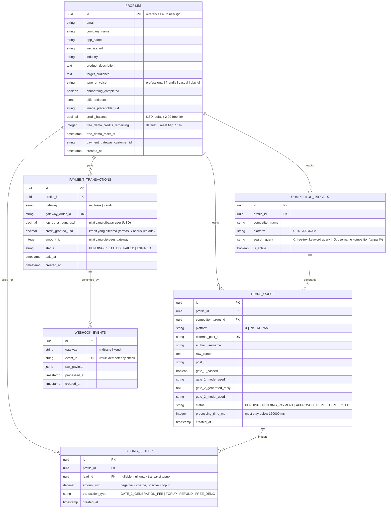

# PRODUCT REQUIREMENTS DOCUMENT (PRD) & ERD
## Undercut — Competitor FUD Interceptor (AI Social Lead Gen, Full SaaS Edition)

**Project Name:** Undercut
**Target Event:** HackOnVibe Edition (Tema: Effective promotion of a newly launched mobile app)
**Product Tier:** Full Working SaaS (bukan sekadar demo hackathon — dirancang untuk tetap hidup & billable setelah acara selesai)
**Architecture Style:** Serverless Monolith (Next.js App Router + Supabase)
**Versi Dokumen:** 3.0 — Revisi besar: Landing Page, Dashboard Split X/IG, Input berbeda per platform, Top-up fleksibel, Design reference TweetHunter + ReplyGuy UX

---

## 1. Executive Summary & Problem Statement

Aplikasi seluler yang baru rilis menghadapi kesulitan besar dalam akuisisi 100 pengguna pertama (*Cold Start Problem*). Di sisi lain, pengguna dari aplikasi kompetitor sering mengekspresikan keluhan atau ketidakpuasan (*FUD — Fear, Uncertainty, Doubt*) di media sosial seperti X (Twitter) dan Instagram.

**Undercut** adalah alat intelijen pasar yang mengotomatisasi pemantauan keluhan kompetitor, memverifikasinya menggunakan kecerdasan buatan, lalu menghasilkan draf balasan promosi yang kontekstual dan profesional — disesuaikan dengan keunggulan produk milik pengguna. Sistem ini memakai pendekatan **Semi-Automated (Human-in-the-Loop)**: AI menyiapkan draf berkualitas, manusia yang menekan tombol kirim. Ini menghindari risiko *shadowban* dari platform sosial karena tidak ada bot yang mem-posting secara otomatis di background.

**Perbedaan dari versi sebelumnya:** Dokumen ini menambahkan landing page lengkap (Module G), memisahkan dashboard X dan Instagram dengan input berbeda (X: keyword/query bebas, IG: username kompetitor), sistem top-up kredit yang lebih fleksibel (nilai bebas mulai $2 dengan template cepat), serta panduan desain yang terinspirasi visual TweetHunter dan UX alur ReplyGuy.

---

## 2. Target Audience & Business Model

- **Target Pengguna:** Indie hacker, pengembang aplikasi seluler, dan tim pemasaran digital (B2B SaaS), mayoritas basis pengguna awal kemungkinan dari Indonesia/Asia Tenggara.
- **Model Monetisasi:** *Pay-Per-Cycle Credit Model.*
  - **Harga per siklus sukses: $0.10** (dipotong **hanya** jika Gate 2 berhasil menghasilkan draf balasan; jika Gate 1 menolak lead, tidak ada biaya).
  - Free tier saat pendaftaran: kredit awal senilai **$2.00** (setara 20 siklus) agar pengguna baru bisa mencoba produk tanpa kartu kredit.
  - **(Free Demo Mingguan):** setiap akun dapat **3 siklus gratis per minggu**, terpisah dari `credit_balance` dan tidak pernah habis permanen (reset otomatis tiap 7 hari). Ini jalan terus meskipun saldo kredit user sudah $0 — tujuannya supaya produk tetap punya nilai buat dicoba ulang tiap minggu (retention hook), dan juri/pengunjung hackathon bisa coba tanpa perlu top up.

### 2.1 Sistem Top-Up Kredit — Fleksibel (Baru di v3.0)

Tidak ada paket tetap. User bisa top-up dengan **nilai bebas mulai dari $2**. UI menampilkan tombol cepat (template amount) untuk kemudahan:

| Template | Kredit | Setara Siklus |
|---|---|---|
| $2 | $2.00 | 20 siklus |
| $5 | $5.00 | 50 siklus |
| $10 | $10.00 | 100 siklus |
| $15 | $15.00 | 150 siklus |
| $30 | $30.00 | 300 siklus |
| $50 | $51.50 (+3% bonus) | 515 siklus |
| $100 | $105.00 (+5% bonus) | 1050 siklus |

> Bonus hanya berlaku untuk template $50 dan $100 untuk insentif top-up lebih besar. Untuk nilai bebas, tidak ada bonus.

**Mekanisme top-up:**
1. User masukkan nilai bebas (minimal $2) atau klik template cepat.
2. Nilai USD dikonversi ke IDR saat checkout (rate tetap dari konfigurasi server, misal `1 USD = Rp16.000`).
3. Midtrans Snap popup tampil dengan harga IDR.
4. Setelah `SETTLED` via webhook, `credit_balance` di-update.
5. Kolom `top_up_amount_usd` dan `credit_granted_usd` di `payment_transactions` menyimpan keduanya (amount yang dibayar dan kredit yang diterima, termasuk bonus jika ada).

### 2.2 Kenapa Tidak Charge $0.10 Langsung per Transaksi?

Tidak ada payment gateway yang efisien untuk transaksi sekecil $0.10 (~Rp1.600). Biaya admin fee gateway jauh melebihi nilai transaksinya. Solusi: **model dompet kredit prabayar (prepaid credit wallet)** — user top-up sekali, saldo dipotong per pemakaian.

---

## 3. Payment Gateway — Rekomendasi

### 3.1 Pilihan Utama: Midtrans
- **Snap.js** = UI checkout siap pakai (popup), tidak perlu bangun halaman pembayaran sendiri.
- Mendukung GoPay, QRIS, Virtual Account semua bank besar, kartu kredit/debit.
- Alur: user input nilai top-up → konversi ke IDR → `POST` ke Midtrans Snap API → dapat `redirect_url`/`token` → tampilkan Snap popup → tunggu webhook → update `credit_balance`.
- **Catatan:** Midtrans hanya memproses IDR.

### 3.2 Alternatif: Xendit
- API lebih modern, punya fitur recurring/subscription bawaan.
- Coverage regional lebih luas untuk ekspansi Asia Tenggara.

### 3.3 Rekomendasi Praktis
Untuk hackathon 48 jam **pakai Midtrans Snap**. Simpan `payment_gateway` sebagai kolom, bukan hardcode, supaya nanti gampang tambah Xendit.

**Wajib:** jangan pernah menandai kredit sebagai "terisi" hanya dari redirect balik ke halaman sukses. Selalu konfirmasi lewat webhook server-to-server (`/api/billing/webhook/midtrans`), handler-nya **idempotent** (lihat tabel `webhook_events` di ERD).

---

## 4. Core Features & Functional Requirements

### 4.1 Module A: Data Ingestion & Scraper Engine

- **A.1. RapidAPI Integration — provider ditentukan:**

  | Platform | RapidAPI Provider | Host | Tipe Input |
  |---|---|---|---|
  | X (Twitter) | [twitter-api45](https://rapidapi.com/alexanderxbx/api/twitter-api45) | `twitter-api45.p.rapidapi.com` | **Free-text keyword/query** |
  | Instagram | [instagram-scraper-stable-api](https://rapidapi.com/thetechguy32744/api/instagram-scraper-stable-api) | `instagram-scraper-stable-api.p.rapidapi.com` | **Username kompetitor** |

  **X (Twitter) — sudah terverifikasi:**
  - Endpoint pencarian: `GET /search.php?query={keyword}&search_type=Latest` → response `{ "timeline": [...] }`, tiap item punya `tweet_id`, `text`, `screen_name`, dll.
  - Input field di dashboard: **free-text query** (mis. `"@CompetitorApp OR #CompetitorFail"`).
  - Auth: header `X-RapidAPI-Key` + `X-RapidAPI-Host: twitter-api45.p.rapidapi.com`.

  **Instagram — input berubah jadi username (v3.0):**
  
  ⚠️ **Keputusan arsitektur baru:** Berdasarkan evaluasi ulang endpoint Instagram yang tersedia, input untuk target Instagram **diganti menjadi username kompetitor** (bukan free-text keyword). Alasannya:
  - Endpoint `search_ig.php` mengembalikan campuran hasil (user, hashtag, lokasi, post) yang sulit diklasifikasi secara andal sebagai "keluhan spesifik kompetitor".
  - Strategi yang lebih tepat dan dapat diandalkan: ambil **postingan terbaru dari akun resmi kompetitor** menggunakan endpoint User/Media, lalu scrape komentar atau mention di postingan tersebut — atau pantau posts dari akun publik yang sering mengeluhkan kompetitor.
  - Ini juga lebih natural bagi pengguna: "tambahkan kompetitor dengan username Instagram mereka".

  Endpoint yang digunakan untuk Instagram:
  ```
  GET https://instagram-scraper-stable-api.p.rapidapi.com/get_user_posts.php
  Query param: username={competitor_username}
  x-rapidapi-host: instagram-scraper-stable-api.p.rapidapi.com
  x-rapidapi-key: {RAPIDAPI_KEY}
  ```
  Pipeline kemudian mengambil caption/komentar dari postingan terbaru kompetitor untuk dicari FUD yang ada di dalamnya.

  > Jika endpoint `get_user_posts.php` tidak tersedia di paket RapidAPI yang dipakai, log error dan fallback ke mock data. **Validasi path endpoint ini saat development pertama — jangan diasumsikan.**

- **A.2. Mock Data Fallback:** switch di environment (`USE_MOCK_SCRAPER=true`) untuk pakai Mock DB kalau API eksternal kena rate limit/gangguan saat demo.
- **A.3. Data Normalization:** ubah raw payload dari berbagai sumber jadi skema standar sebelum masuk `leads_queue`.
- **A.4. Deduplication:** cek `external_post_id` unik sebelum insert.
- **A.5. Scheduled Polling:** cron job polling tiap kompetitor aktif setiap 10–15 menit.

### 4.2 Module B: Double-Gate LLM Pipeline

Batas waktu eksekusi maksimal: **tidak boleh melebihi 150 detik**.

#### Gate 1: Relevance & Sentiment Classifier (The Filter)
- **Input:** teks mentah dari postingan media sosial.
- **Task:** menentukan apakah teks benar-benar mengeluhkan/membahas kekurangan aplikasi kompetitor yang relevan.
- **Output:** Boolean (`true`/`false`). Jika `false` → proses berhenti, **tidak ada biaya**.
- **Model:** model gratis dari **OpenRouter** dengan strategi *router + fallback chain*:
  1. **Primary:** `openrouter/free` — auto-router bawaan OpenRouter.
  2. **Fallback eksplisit:** `meta-llama/llama-3.3-70b-instruct:free`, `openai/gpt-oss-20b:free`. **Wajib dicek ulang di `openrouter.ai/models` sebelum submission.**

⚠️ Rate limit model gratis (20 rpm/200 rpd) adalah batas nyata. Cukup untuk demo hackathon dan early-stage SaaS, tapi bangun Gate 1 dengan *provider-agnostic* wrapper dari awal.

#### Gate 2: Contextual Promotional Generator (The Closer)
- **Input:** teks postingan yang lolos Gate 1 + profil perusahaan user (company_name, product_description, target_audience, tone_of_voice, differentiators).
- **Task:** menghasilkan draf balasan yang ramah, natural, tidak terlihat seperti bot spam.
- **Output:** teks draf balasan siap pakai (< 280 karakter untuk X, < 500 karakter untuk IG) + pemotongan **$0.10** dari `credit_balance`.
- **Model:** **DeepSeek V4 Flash** via OpenRouter (`deepseek/deepseek-v4-flash`).

**Alur biaya:**
- Gate 1 gagal → gratis, lead ditandai `REJECTED`.
- Gate 1 lolos → panggil `consume_cycle_credit()`:
  - Masih ada free demo minggu ini → pakai itu (gratis, tercatat `FREE_DEMO`).
  - Demo habis, saldo cukup → potong $0.10 (`GATE_2_GENERATION_FEE`).
  - Keduanya habis → lead `PENDING_PAYMENT`, Gate 2 **tidak dipanggil**.
- Gate 2 sukses → lead berstatus `PENDING` (siap direview user di dashboard).

### 4.3 Module C: Rapid-Fire Dashboard UI (Split X / Instagram)

Dashboard dipisah menjadi **dua tab/panel terpisah**: satu untuk X, satu untuk Instagram. Pengguna memilih platform dulu sebelum mengelola target dan melihat antrean lead.

#### C.1. Sidebar / Top Navigation Platform Switcher
- Tab/switcher **X (Twitter)** dan **Instagram** yang selalu terlihat.
- State aktif disimpan di URL: `/dashboard/x` dan `/dashboard/instagram`.
- Badge counter menampilkan jumlah lead pending untuk tiap platform.

#### C.2. Panel Target Kompetitor (per Platform)

**Panel X:**
- Kolom input: `competitor_name` (label/alias) + `search_keywords` (**free-text query**, mis. `"@TokopediaCare lambat OR #TokopediFail"`).
- Placeholder dan helper text menjelaskan format query X (boolean operator, hashtag, mention).
- Maksimal 5 target aktif per user (MVP limit).

**Panel Instagram:**
- Kolom input: `competitor_name` (label/alias) + `ig_username` (**username saja**, mis. `tokopedia` tanpa @).
- Sistem akan memantau postingan terbaru dari akun tersebut.
- Validasi: strip karakter `@` otomatis jika user salah input dengan `@`.
- Maksimal 5 target aktif per user (MVP limit).

#### C.3. Lead Queue Panel (per Platform)
- Kartu-kartu antrean lead yang sudah lolos Gate 2, urut dari terbaru.
- Tiap kartu menampilkan:
  - Avatar + username penulis postingan.
  - Teks asli postingan (truncated, bisa expand).
  - **Draf balasan AI** (editable inline sebelum dikirim).
  - Tombol aksi utama.

#### C.4. Semi-Auto Action Buttons
- **Tombol "Reply on X":** buka tab baru pakai X Intent URL: `https://twitter.com/intent/tweet?in_reply_to={id}&text={encoded_reply}`.
- **Tombol "Reply on IG":** salin teks balasan ke clipboard + buka URL postingan IG di tab baru (karena IG tidak punya public intent URL).
- Setelah diklik, status kartu otomatis jadi `REPLIED` dan hilang dari antrean aktif.

#### C.5. DIFFERENTIATOR & Asset Panel
- Kotak perbandingan fitur (app user vs kompetitor) yang bisa diedit inline.
- Panel ini muncul di sidebar atau accordion di bawah, bisa di-collapse.

#### C.6. Credit Balance & Free Demo Widget
- Selalu terlihat di header dashboard.
- Tampilkan: saldo kredit real-time (`$X.XX`), sisa kuota demo minggu ini (`X/3 demo gratis tersisa, reset Senin`), tombol **"Top Up"** yang buka panel top-up.

#### C.7. Low Balance Guard
- Kalau free demo **dan** `credit_balance < $0.10`, pipeline berhenti memproses lead baru untuk user tsb (status lead jadi `PENDING_PAYMENT`).
- Banner sticky di dashboard: *"Saldo habis. Top up untuk lanjut memproses lead."*

> **Di luar cakupan (eksplisit):** tidak ada bot auto-reply background. Semua pengiriman balasan butuh satu klik manusia. Keputusan produk yang disengaja untuk hindari shadowban.

### 4.4 Module D: Auth & Multi-Tenancy

- **Supabase Auth — Google OAuth saja.** Satu tombol "Sign in with Google".
- **Row Level Security (RLS)** wajib aktif di semua tabel.
- Service role key hanya di server-side route.
- **Trigger otomatis:** saat user pertama kali Google sign-in, buat row `profiles` otomatis lewat Postgres trigger `on_auth_user_created`.

### 4.5 Module E: Company Profile & Onboarding

- **E.1. Onboarding Gate:** setelah login Google pertama kali, user diarahkan ke `/profile`. Field wajib:
  - `company_name` — nama perusahaan/produk.
  - `app_name` — nama aplikasi yang dipromosikan.
  - `website_url` — link resmi.
  - `industry` — niche/kategori.
  - `product_description` — 2–3 kalimat fungsi aplikasi. **Konteks paling penting buat Gate 2.**
  - `target_audience` — siapa target user aplikasi ini.
  - `tone_of_voice` — pilihan: `professional` | `friendly` | `casual` | `playful`.
  - `differentiators` — 3 poin keunggulan vs kompetitor.
  - `onboarding_completed` di-set `TRUE` otomatis begitu semua field wajib terisi.
- **E.2. Route Guard:** middleware Next.js cek `onboarding_completed` — kalau `FALSE`, redirect paksa ke `/profile`.
- **E.3. Prompt Gate 2 kaya konteks:** system prompt Gate 2 menyertakan `company_name`, `product_description`, `target_audience`, `tone_of_voice`, `differentiators`.
- **E.4. Edit ulang:** user bisa update profil perusahaan kapan saja lewat `/profile`.

### 4.6 Module F: Billing & Credit Ledger

- `POST /api/billing/topup` → generate Midtrans Snap transaction.
  - Body: `{ amount_usd: number }` (bebas, min 2.0).
  - Server konversi ke IDR, hitung bonus jika template $50/$100, buat transaksi Midtrans.
- `POST /api/billing/webhook/midtrans` → verifikasi signature, idempotent, update `credit_balance`.
- Gate 2 sukses → panggil `consume_cycle_credit(profile_id)` (atomic).
- Riwayat transaksi (topup + pemakaian + demo gratis) di `/billing`.

### 4.7 Module G: Landing Page (Baru di v3.0)

Landing page adalah halaman publik di route `/` yang ditampilkan kepada semua pengunjung sebelum login. Desain mengacu pada **TweetHunter.io** (visual premium, dark mode, clean typography) dan alur penjelasan mengacu pada **ReplyGuy.com** (step-by-step storytelling, value comparison manual vs tool).

#### G.1. Navbar
- Logo "Undercut" di kiri.
- Link navigasi: `How it Works` | `Pricing` | `FAQ` | `Docs`.
- Tombol di kanan: **"Log In"** (ghost/outline) dan **"Try for Free"** (CTA utama, warna accent).
- Sticky navbar, transparan di atas → solid saat scroll.
- Mobile: hamburger menu.

#### G.2. Hero Section
- **Headline utama (H1):** *"Turn competitor complaints into your next customers."*
- **Sub-headline:** *"Undercut monitors social media for FUD about your competitors. AI drafts the perfect reply. You click send."*
- **CTA utama:** Tombol besar **"Start for Free"** → arahkan to `/login`.
- **Sub-CTA:** teks kecil *"No credit card needed. 3 free cycles every week."*
- **Social proof:** badge sederhana, mis. *"★★★★★ Trusted by indie hackers & app devs"*.
- **Hero visual:** mockup dashboard Undercut (screenshot atau ilustrasi) di kanan halaman.
- Background: dark mode dengan subtle gradient atau mesh gradient.

#### G.3. Problem Agitation Section (ReplyGuy-style)
Dua kolom perbandingan:

| Tanpa Undercut (manual) | Dengan Undercut |
|---|---|
| Monitor tiap platform setiap jam (30 min/hari) | Setup target sekali, 2 menit |
| Baca ratusan postingan satu per satu (1 jam/hari) | AI menyaring otomatis |
| Tulis balasan personal tiap kali (1–2 jam/hari) | AI draft dulu, kamu tinggal kirim |
| **Total: 2–4 jam/hari per kompetitor** | **Total: beberapa klik per hari** |

Penutup section: *"Save 50+ hours a month. Focus on building, not monitoring."*

#### G.4. How It Works Section (Step-by-Step, ReplyGuy-style)
5 langkah bernomor dengan ikon, teks singkat, dan ilustrasi/screenshot per langkah:

1. **Set up your profile** — Isi info produk Anda sekali. AI butuh konteks ini untuk buat balasan yang personal.
2. **Add competitors** — Tambahkan kompetitor X (dengan keyword) atau Instagram (dengan username). Kami yang pantau.
3. **AI filters the noise** — Gate 1 menyaring ribuan postingan. Hanya keluhan relevan yang lolos.
4. **Get ready-to-send replies** — Gate 2 menyusun draf balasan kontekstual. Anda tinggal review.
5. **Click & reply** — Klik tombol, balasan terkirim dari akun Anda. Bukan dari bot. Aman dari shadowban.

#### G.5. Features Highlight Section (TweetHunter-style cards)
Grid 3 kolom dengan feature card:

- 🎯 **Dual Platform** — Pantau X (via keyword) dan Instagram (via username) dalam satu dashboard.
- 🤖 **Double-Gate AI** — Gate 1 filter gratis, Gate 2 buat balasan hanya jika lead relevan.
- ✋ **Human-in-the-Loop** — AI draft, kamu kirim. Tidak ada bot posting tanpa izinmu.
- 💳 **Pay as You Go** — Top up mulai $2. Bayar $0.10 per balasan sukses. Tidak ada langganan.
- 🎁 **Free Weekly Demo** — 3 siklus gratis per minggu untuk semua user, reset otomatis.
- 🔒 **Data Isolation** — Row Level Security memastikan data Anda hanya terlihat oleh Anda.

#### G.6. Pricing Section
- Judul: *"Simple, transparent pricing."*
- Sub-judul: *"No subscription. Pay for what you use."*
- Highlight utama dalam satu card besar:
  - **$0.10 per successful reply draft**
  - Gratis jika AI menilai postingan tidak relevan (Gate 1 reject)
  - **$2.00 free credits** saat daftar (20 siklus gratis)
  - **3 free cycles every week**, forever
- Top-up section: tampilkan grid template tombol ($2, $5, $10, $15, $30, $50, $100) dalam preview visual, dengan catatan "or enter any amount from $2".
- CTA: **"Get Started Free"**.

#### G.7. FAQ Section
Format accordion (satu terbuka, sisanya collapse):

1. *Apakah Undercut mem-posting balasan secara otomatis?* — Tidak. Anda selalu yang menekan tombol kirim. Kami hanya menyiapkan draf.
2. *Apa bedanya keyword (X) dan username (Instagram)?* — Di X, sistem mencari postingan berdasarkan keyword/hashtag yang Anda tentukan. Di Instagram, sistem memantau postingan terbaru dari akun kompetitor yang Anda tambahkan via username mereka.
3. *Apakah ada biaya jika postingan tidak relevan?* — Tidak. Gate 1 (filter relevansi) 100% gratis. Biaya $0.10 hanya dipotong jika Gate 2 berhasil membuat draf balasan.
4. *Metode pembayaran apa yang tersedia?* — GoPay, QRIS, Virtual Account semua bank besar, dan kartu kredit/debit (via Midtrans).
5. *Berapa lama saldo kredit berlaku?* — Tidak ada kadaluarsa. Saldo kredit (`credit_balance`) berlaku selamanya. Hanya kuota demo mingguan yang reset tiap 7 hari.
6. *Apakah ada batasan jumlah kompetitor yang bisa dipantau?* — Di MVP, maksimal 5 target aktif per platform (5 keyword X + 5 username IG). Bisa dikembangkan ke depannya.

#### G.8. Footer
- Logo + tagline singkat.
- Link: `Privacy Policy` | `Terms of Service` | `Docs` | `Contact`.
- Copyright.

---

## 5. Non-Functional Requirements

| Aspek | Requirement |
|---|---|
| **Latency** | Pipeline Gate 1→Gate 2 ≤ 150 detik per lead |
| **Reliability** | Webhook payment handler idempotent (aman di-retry oleh Midtrans) |
| **Security** | RLS aktif semua tabel; service role key hanya server-side; signature verification wajib di webhook |
| **Cost Control** | Gate 1 tidak pernah menagih user (gratis by design); circuit breaker mock fallback saat scraper API down |
| **Observability** | `processing_time_ms` dan `model_used` dicatat per lead untuk audit & debugging rotasi model gratis |
| **Compliance** | Kalau nanti terima pembayaran dari luar Indonesia, cek kewajiban PPN PMSE (regulasi DJP) |

---

## 6. Technical Stack

- **Framework:** Next.js (App Router), TailwindCSS, Lucide Icons.
- **Database & Auth:** Supabase (PostgreSQL + Supabase Auth Google OAuth only + RLS).
- **LLM Provider:** OpenRouter — Gate 1 pakai model gratis (auto-router + fallback list), Gate 2 pakai `deepseek/deepseek-v4-flash`.
- **Payment Gateway:** Midtrans (Snap) — primary.
- **Scraper Source:** RapidAPI — `twitter-api45` (X, keyword) & `instagram-scraper-stable-api` (Instagram, username), dengan mock fallback.
- **Documentation:** Fumadocs di route `/docs`.
- **Deployment:** CI/CD otomatis via GitHub.

---

## 7. ENTITY RELATIONSHIP DIAGRAM (ERD)



---

## 8. Supabase SQL Schema Definitions

### Tabel `profiles` (Config, Company Profile & Wallet)

```sql
CREATE TABLE profiles (
    id UUID PRIMARY KEY REFERENCES auth.users(id) ON DELETE CASCADE,
    email VARCHAR(255) NOT NULL UNIQUE,

    -- Company Profile (diisi saat onboarding, dipakai sebagai konteks Gate 2)
    company_name VARCHAR(150),
    app_name VARCHAR(100) NOT NULL DEFAULT 'My New App',
    website_url TEXT,
    industry VARCHAR(100),
    product_description TEXT,
    target_audience TEXT,
    tone_of_voice VARCHAR(20) DEFAULT 'friendly'
        CHECK (tone_of_voice IN ('professional', 'friendly', 'casual', 'playful')),
    onboarding_completed BOOLEAN DEFAULT FALSE,
    differentiators JSONB DEFAULT '{"differentiator_1": "10x Faster Execution", "differentiator_2": "Zero Setup Fees", "differentiator_3": "AI-Powered Automation"}'::jsonb,
    image_placeholder_url TEXT DEFAULT 'https://via.placeholder.com/400x600.png?text=App+UI+Preview',

    -- Wallet & Free Demo
    credit_balance DECIMAL(10, 4) DEFAULT 2.0000, -- Free tier: $2.00 (~20 siklus)
    free_demo_credits_remaining INTEGER DEFAULT 3, -- reset tiap 7 hari, terpisah dari credit_balance
    free_demo_reset_at TIMESTAMPTZ DEFAULT (NOW() + INTERVAL '7 days'),
    payment_gateway_customer_id VARCHAR(100),

    created_at TIMESTAMPTZ DEFAULT NOW()
);

ALTER TABLE profiles ENABLE ROW LEVEL SECURITY;
CREATE POLICY "Users can view/update own profile"
    ON profiles FOR ALL
    USING (auth.uid() = id);

-- Auto-create row profiles saat user pertama kali Google sign-in
CREATE OR REPLACE FUNCTION handle_new_user()
RETURNS TRIGGER AS $$
BEGIN
    INSERT INTO public.profiles (id, email)
    VALUES (NEW.id, NEW.email);
    RETURN NEW;
END;
$$ LANGUAGE plpgsql SECURITY DEFINER;

CREATE TRIGGER on_auth_user_created
    AFTER INSERT ON auth.users
    FOR EACH ROW EXECUTE FUNCTION handle_new_user();
```

### Tabel `competitor_targets` (Scraper Rules)

```sql
CREATE TABLE competitor_targets (
    id UUID PRIMARY KEY DEFAULT gen_random_uuid(),
    profile_id UUID REFERENCES profiles(id) ON DELETE CASCADE,
    competitor_name VARCHAR(100) NOT NULL,
    platform VARCHAR(20) CHECK (platform IN ('X', 'INSTAGRAM')),
    -- search_query field berbeda per platform:
    --   X: free-text query untuk endpoint /search.php
    --      mis. "@CompetitorApp OR #CompetitorFail"
    --   INSTAGRAM: username kompetitor (tanpa @) untuk endpoint get_user_posts.php
    --      mis. "tokopedia"
    search_query VARCHAR(255) NOT NULL,
    is_active BOOLEAN DEFAULT TRUE,
    created_at TIMESTAMPTZ DEFAULT NOW()
);

ALTER TABLE competitor_targets ENABLE ROW LEVEL SECURITY;
CREATE POLICY "Users manage own competitor targets"
    ON competitor_targets FOR ALL
    USING (auth.uid() = profile_id);
```

### Tabel `leads_queue` (Core Pipeline Storage)

```sql
CREATE TABLE leads_queue (
    id UUID PRIMARY KEY DEFAULT gen_random_uuid(),
    profile_id UUID REFERENCES profiles(id) ON DELETE CASCADE,
    competitor_target_id UUID REFERENCES competitor_targets(id) ON DELETE SET NULL,
    platform VARCHAR(20) CHECK (platform IN ('X', 'INSTAGRAM')),
    external_post_id VARCHAR(100) UNIQUE NOT NULL,
    author_username VARCHAR(100) NOT NULL,
    raw_content TEXT NOT NULL,
    post_url TEXT NOT NULL,
    gate_1_passed BOOLEAN DEFAULT FALSE,
    gate_1_model_used VARCHAR(100),
    gate_2_generated_reply TEXT,
    gate_2_model_used VARCHAR(100),
    status VARCHAR(20) DEFAULT 'PENDING'
        CHECK (status IN ('PENDING', 'PENDING_PAYMENT', 'APPROVED', 'REPLIED', 'REJECTED')),
    processing_time_ms INTEGER, -- must stay below 150000 ms (150s limit)
    created_at TIMESTAMPTZ DEFAULT NOW()
);

ALTER TABLE leads_queue ENABLE ROW LEVEL SECURITY;
CREATE POLICY "Users manage own leads"
    ON leads_queue FOR ALL
    USING (auth.uid() = profile_id);
```

### Tabel `billing_ledger` (Usage & Topup Log)

```sql
CREATE TABLE billing_ledger (
    id UUID PRIMARY KEY DEFAULT gen_random_uuid(),
    profile_id UUID REFERENCES profiles(id) ON DELETE CASCADE,
    lead_id UUID REFERENCES leads_queue(id) ON DELETE SET NULL,
    amount_usd DECIMAL(10, 4) NOT NULL DEFAULT -0.1000, -- $0.10 per cycle, 0 untuk free demo
    transaction_type VARCHAR(50) DEFAULT 'GATE_2_GENERATION_FEE'
        CHECK (transaction_type IN ('GATE_2_GENERATION_FEE', 'FREE_DEMO', 'TOPUP', 'REFUND')),
    created_at TIMESTAMPTZ DEFAULT NOW()
);

ALTER TABLE billing_ledger ENABLE ROW LEVEL SECURITY;
CREATE POLICY "Users view own ledger"
    ON billing_ledger FOR SELECT
    USING (auth.uid() = profile_id);
```

### Fungsi `consume_cycle_credit` (Free Demo + Charge, Atomic)

Dipanggil server-side tepat sebelum Gate 2 dijalankan. Pakai `SELECT ... FOR UPDATE` supaya aman dari race condition.

```sql
CREATE OR REPLACE FUNCTION consume_cycle_credit(p_profile_id UUID, p_lead_id UUID)
RETURNS VARCHAR AS $$
DECLARE
    v_profile profiles%ROWTYPE;
BEGIN
    SELECT * INTO v_profile FROM profiles WHERE id = p_profile_id FOR UPDATE;

    -- Reset kuota demo mingguan kalau sudah lewat 7 hari
    IF NOW() >= v_profile.free_demo_reset_at THEN
        UPDATE profiles
        SET free_demo_credits_remaining = 3,
            free_demo_reset_at = NOW() + INTERVAL '7 days'
        WHERE id = p_profile_id;
        v_profile.free_demo_credits_remaining := 3;
    END IF;

    -- Prioritas 1: pakai free demo dulu kalau masih ada
    IF v_profile.free_demo_credits_remaining > 0 THEN
        UPDATE profiles
        SET free_demo_credits_remaining = free_demo_credits_remaining - 1
        WHERE id = p_profile_id;

        INSERT INTO billing_ledger (profile_id, lead_id, amount_usd, transaction_type)
        VALUES (p_profile_id, p_lead_id, 0, 'FREE_DEMO');

        RETURN 'FREE_DEMO';
    END IF;

    -- Prioritas 2: potong credit_balance kalau cukup
    IF v_profile.credit_balance >= 0.10 THEN
        UPDATE profiles
        SET credit_balance = credit_balance - 0.10
        WHERE id = p_profile_id;

        INSERT INTO billing_ledger (profile_id, lead_id, amount_usd, transaction_type)
        VALUES (p_profile_id, p_lead_id, -0.10, 'GATE_2_GENERATION_FEE');

        RETURN 'CHARGED';
    END IF;

    -- Saldo & demo habis
    RETURN 'INSUFFICIENT_BALANCE';
END;
$$ LANGUAGE plpgsql SECURITY DEFINER;
```

### Tabel `payment_transactions` (Log Transaksi Gateway)

```sql
CREATE TABLE payment_transactions (
    id UUID PRIMARY KEY DEFAULT gen_random_uuid(),
    profile_id UUID REFERENCES profiles(id) ON DELETE CASCADE,
    gateway VARCHAR(20) NOT NULL DEFAULT 'midtrans' CHECK (gateway IN ('midtrans', 'xendit')),
    gateway_order_id VARCHAR(100) UNIQUE NOT NULL,
    top_up_amount_usd DECIMAL(10, 4) NOT NULL, -- nilai yang dibayar user dalam USD
    credit_granted_usd DECIMAL(10, 4) NOT NULL, -- kredit diterima (termasuk bonus jika ada)
    amount_idr INTEGER NOT NULL,               -- nilai yang diproses gateway dalam IDR
    status VARCHAR(20) DEFAULT 'PENDING'
        CHECK (status IN ('PENDING', 'SETTLED', 'FAILED', 'EXPIRED')),
    paid_at TIMESTAMPTZ,
    created_at TIMESTAMPTZ DEFAULT NOW()
);

ALTER TABLE payment_transactions ENABLE ROW LEVEL SECURITY;
CREATE POLICY "Users view own transactions"
    ON payment_transactions FOR SELECT
    USING (auth.uid() = profile_id);
```

### Tabel `webhook_events` (Idempotency Guard)

```sql
CREATE TABLE webhook_events (
    id UUID PRIMARY KEY DEFAULT gen_random_uuid(),
    gateway VARCHAR(20) NOT NULL,
    event_id VARCHAR(150) UNIQUE NOT NULL, -- e.g. order_id + status_code dari Midtrans
    raw_payload JSONB,
    processed_at TIMESTAMPTZ,
    created_at TIMESTAMPTZ DEFAULT NOW()
);
-- Tabel ini TIDAK butuh RLS karena hanya diakses service role di server.
```

---

## 9. API Endpoint Spec (Ringkas)

| Method | Endpoint | Fungsi |
|---|---|---|
| `POST` | `/api/ingest/scrape` | Trigger cron/manual scraping RapidAPI → normalize → insert `leads_queue` |
| `POST` | `/api/pipeline/process-lead` | Jalankan Gate 1 → `consume_cycle_credit()` → Gate 2 untuk satu lead, update status |
| `GET` | `/api/leads` | List antrean lead milik user, query param `?platform=X\|INSTAGRAM` |
| `POST` | `/api/leads/:id/reply` | Tandai `REPLIED` setelah user klik tombol reply |
| `GET/PUT` | `/api/profile` | Baca/update company profile + set `onboarding_completed` |
| `POST` | `/api/competitors` | CRUD `competitor_targets` |
| `GET` | `/api/competitors` | List semua target milik user, query param `?platform=X\|INSTAGRAM` |
| `POST` | `/api/billing/topup` | Buat Midtrans Snap transaction — body: `{ amount_usd: number, min: 2.0 }`, hitung IDR + bonus, return `token` |
| `POST` | `/api/billing/webhook/midtrans` | Terima notifikasi server-to-server, verifikasi signature, update saldo (idempotent) |
| `GET` | `/api/billing/history` | Riwayat `billing_ledger` + `payment_transactions` |
| `GET` | `/api/billing/status` | Saldo kredit + sisa free demo + tanggal reset, untuk widget C.6 |

---

## 10. Frontend Routes & Pages

| Route | Halaman | Catatan |
|---|---|---|
| `/` | **Landing Page** | Publik. Navbar, Hero, Problem Agitation, How It Works, Features, Pricing, FAQ, Footer. Desain TweetHunter-style (dark, premium). Alur penjelasan ReplyGuy-style. |
| `/login` | Sign in | Tombol tunggal "Sign in with Google" (Supabase OAuth). Redirect ke `/profile` atau `/dashboard` sesuai status onboarding. |
| `/profile` | **Company Profile** | Wajib diisi sebelum akses halaman lain (onboarding gate). Juga jadi halaman edit profil. |
| `/dashboard` | Redirect | Redirect otomatis ke `/dashboard/x` (platform default). |
| `/dashboard/x` | **Dashboard X (Twitter)** | Panel target kompetitor X (input: keyword/query). Lead queue hanya dari platform X. Credit widget, tombol Reply on X. |
| `/dashboard/instagram` | **Dashboard Instagram** | Panel target kompetitor IG (input: username). Lead queue hanya dari platform Instagram. Credit widget, tombol Reply on IG. |
| `/billing` | Billing & Top Up | Input nilai bebas (min $2) + template cepat ($2–$100). Riwayat transaksi. |
| `/docs` | Dokumentasi | Fumadocs di App Router yang sama. Konten minimal: Getting Started, Cara Kerja Pipeline, Billing Guide, FAQ. |

**Middleware route guard:**
- Semua route kecuali `/`, `/login`, `/docs/*` butuh sesi login.
- Semua route kecuali `/`, `/login`, `/profile`, `/docs/*` butuh `onboarding_completed = true`.

---

## 11. Design System & UI Guidelines

### Referensi Desain
- **Visual style:** [TweetHunter.io](https://tweethunter.io) — dark mode premium, clean typography (Inter font), subtle gradients, high-contrast CTA buttons, glassmorphism cards.
- **UX & Copywriting:** [ReplyGuy.com](https://replyguy.com) — step-by-step storytelling, side-by-side value comparison (before/after), honest & direct messaging.

### Color Palette (Dark Mode First)
- Background utama: `#0F0F11` (near-black)
- Surface card: `#1A1A1F`
- Border subtle: `#2A2A30`
- Accent primary: `#6366F1` (indigo) atau pilihan warna brand
- Accent CTA hover: sedikit lebih terang
- Text primary: `#F4F4F5`
- Text secondary: `#A1A1AA`
- Success: `#22C55E`
- Warning: `#F59E0B`
- Danger: `#EF4444`

### Typography
- Font: **Inter** (Google Fonts) — weight 400, 500, 600, 700.
- Heading hero: 56–68px, weight 700.
- Sub-heading section: 32–40px, weight 600.
- Body: 16–18px, weight 400–500.
- Small/caption: 12–14px.

### Component Guidelines
- Button primary: rounded-full, gradient atau solid accent color, shadow glow efek.
- Button ghost: border tipis, transparan background.
- Cards: rounded-xl, subtle border, hover state dengan slight glow/scale.
- Badge/pill: rounded-full, warna accent atau neutral.
- Input fields: dark background, border accent saat focus, placeholder text jelas.

### Dashboard UX
- Sidebar kiri (desktop) atau tab atas (mobile) untuk platform switcher X / Instagram.
- Lead cards menggunakan grid or vertical list, responsif.
- Skeleton loading state saat data dimuat.
- Toast notification untuk aksi sukses (reply terkirim, top up berhasil, dll).

---

## 12. Environment Variables

```
# Supabase
NEXT_PUBLIC_SUPABASE_URL=
NEXT_PUBLIC_SUPABASE_ANON_KEY=
SUPABASE_SERVICE_ROLE_KEY=

# LLM (OpenRouter)
OPENROUTER_API_KEY=
GATE1_MODEL_PRIMARY=openrouter/free
GATE1_MODEL_FALLBACK=meta-llama/llama-3.3-70b-instruct:free,openai/gpt-oss-20b:free
GATE2_MODEL=deepseek/deepseek-v4-flash

# Scraper (RapidAPI)
RAPIDAPI_KEY=
RAPIDAPI_HOST_TWITTER=twitter-api45.p.rapidapi.com
RAPIDAPI_HOST_INSTAGRAM=instagram-scraper-stable-api.p.rapidapi.com
USE_MOCK_SCRAPER=false

# Payment Gateway (Midtrans)
MIDTRANS_SERVER_KEY=
MIDTRANS_CLIENT_KEY=
MIDTRANS_IS_PRODUCTION=false

# Kurs USD ke IDR (update berkala, atau integrasikan ke API kurs live)
USD_TO_IDR_RATE=16000

# Bonus top-up threshold (USD)
TOPUP_BONUS_TIER_1_THRESHOLD=50
TOPUP_BONUS_TIER_1_PERCENT=3
TOPUP_BONUS_TIER_2_THRESHOLD=100
TOPUP_BONUS_TIER_2_PERCENT=5
```

---

## 13. Out of Scope / Roadmap Selanjutnya

**Sengaja tidak dibangun di versi ini:**
- Bot auto-reply background tanpa persetujuan manusia — risiko shadowban terlalu tinggi.
- Dukungan multi-currency / pembayaran luar Indonesia.
- Model langganan bulanan.
- Analytics dashboard: conversion rate dari reply → klik → install.
- Instagram comment scraping (hanya pantau posts dari username kompetitor).

**Kandidat fase berikutnya:**
- Upgrade Gate 1 ke model berbayar murah otomatis saat traffic melebihi rate limit gratis.
- Analytics: berapa lead yang dibalas, berapa yang di-skip, conversion tracking.
- Xendit sebagai gateway kedua untuk redundancy & ekspansi regional.
- Ekspansi platform: Reddit, LinkedIn.

---

## 14. Instruksi Eksekusi untuk AI Agent

> *"Act as a Senior Full-Stack Engineer. Using the PRD v3.0 and Supabase SQL schema above, initialize a Next.js App Router project with TailwindCSS. Build: (1) a public landing page at `/` with dark-mode premium design (TweetHunter-inspired visual, ReplyGuy-inspired UX copywriting) — Navbar, Hero, Problem Agitation (manual vs tool comparison), How It Works (5 steps), Features grid, Pricing (pay-per-use + top-up templates), FAQ accordion, Footer; (2) Supabase Auth with Google OAuth only and Postgres trigger auto-creating profiles row; (3) a mandatory company-profile onboarding flow at /profile with route guard middleware; (4) a split dashboard — /dashboard/x (X targets use keyword/query input, lead queue filtered by platform X) and /dashboard/instagram (IG targets use username input, lead queue filtered by platform IG) — both share credit widget, differentiator panel, and semi-auto reply buttons; (5) the scraper ingestion endpoint — X uses twitter-api45 /search.php with free-text keyword, Instagram uses instagram-scraper-stable-api get_user_posts.php with username — with dedup and mock fallback; (6) the Double-Gate LLM pipeline via OpenRouter with strict 150-second timeout, calling consume_cycle_credit before Gate 2; (7) a flexible top-up flow at /billing — user inputs any USD amount (min $2) or clicks preset templates ($2/$5/$10/$15/$30/$50/$100), server converts to IDR using USD_TO_IDR_RATE env, applies bonus for $50+ and $100+ tiers, generates Midtrans Snap transaction — with signature-verified idempotent webhook handler; (8) minimal Fumadocs /docs. Treat RLS isolation, onboarding gating, billing correctness, and the X/IG input difference (keyword vs username) as first-class requirements."*
