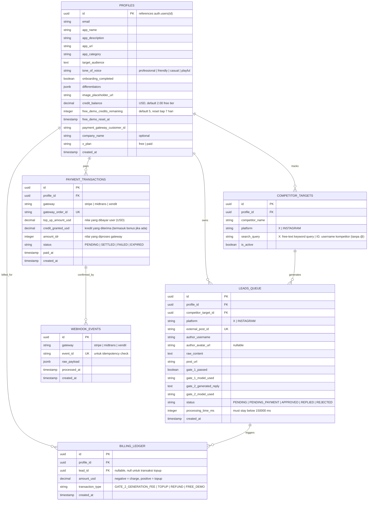

# PRODUCT REQUIREMENTS DOCUMENT (PRD) & ERD
## Undercut — Competitor FUD Interceptor (AI Social Lead Gen, Full SaaS Edition)

**Project Name:** Undercut
**Target Event:** HackOnVibe Edition (Tema: Effective promotion of a newly launched mobile app)
**Product Tier:** Full Working SaaS (bukan sekadar demo hackathon — dirancang untuk tetap hidup & billable setelah acara selesai)
**Architecture Style:** Serverless Monolith (Next.js App Router + Supabase)
**Versi Dokumen:** 4.1 — Revisi keselarasan dengan codebase & database: Memperbarui spesifikasi Stripe gateway default, kuota free demo mingguan (5 siklus), menambahkan kolom `x_plan` (profiles) dan `author_avatar_url` (leads_queue), serta dokumentasi model fallback & penanganan filter Gate 1.

---

## 1. Executive Summary & Problem Statement

Aplikasi seluler yang baru rilis menghadapi kesulitan besar dalam akuisisi 100 pengguna pertama (*Cold Start Problem*). Di sisi lain, pengguna dari aplikasi kompetitor sering mengekspresikan keluhan atau ketidakpuasan (*FUD — Fear, Uncertainty, Doubt*) di media sosial seperti X (Twitter) dan Instagram.

**Undercut** adalah alat intelijen pasar yang mengotomatisasi pemantauan keluhan kompetitor, memverifikasinya menggunakan kecerdasan buatan, lalu menghasilkan draf balasan promosi yang kontekstual dan profesional — disesuaikan dengan keunggulan produk milik pengguna. Sistem ini memakai pendekatan **Semi-Automated (Human-in-the-Loop)**: AI menyiapkan draf berkualitas, manusia yang menekan tombol kirim. Ini menghindari risiko *shadowban* dari platform sosial karena tidak ada bot yang mem-posting secara otomatis di background.

**Perbedaan dari versi sebelumnya (v3.0 → v4.0):**
- **Halaman docs (`/docs`, Fumadocs) dihapus sepenuhnya.** Semua penjelasan produk — cara kerja, FAQ mendalam, daftar fitur lengkap — sekarang hidup di landing page (`/`) itu sendiri. Satu halaman, semua jawaban.
- **Struktur landing page dirombak total**, mengikuti pola konversi TweetHunter.io secara lebih presisi: hero dengan elemen 3D + floating card mockup, strip value-pillar, feature deep-dive dengan "tactic example" bernomor, live interactive demo widget, dan feature checklist lengkap menggantikan fungsi docs.
- **Elemen 3D ditambahkan di hero** — spesifikasi teknis konkret pakai Spline (bukan asumsi vague "3D-ish").
- **End-to-end User Journey/UX flow didokumentasikan** dari kunjungan pertama sampai penggunaan rutin, termasuk detail micro-UX (empty state, optimistic UI, real-time notification, soft paywall) yang sebelumnya belum ada.

---

## 2. Target Audience & Business Model

- **Target Pengguna:** Indie hacker, pengembang aplikasi seluler, dan tim pemasaran digital (B2B SaaS), mayoritas basis pengguna awal kemungkinan dari Indonesia/Asia Tenggara.
- **Model Monetisasi:** *Pay-Per-Cycle Credit Model.*
  - **Harga per siklus sukses: $0.10** (dipotong **hanya** jika Gate 2 berhasil menghasilkan draf balasan; jika Gate 1 menolak lead, tidak ada biaya).
  - Free tier saat pendaftaran: kredit awal senilai **$2.00** (setara 20 siklus) agar pengguna baru bisa mencoba produk tanpa kartu kredit.
  - **(Free Demo Mingguan):** setiap akun dapat **5 siklus gratis per minggu**, terpisah dari `credit_balance` dan tidak pernah habis permanen (reset otomatis tiap 7 hari). Ini jalan terus meskipun saldo kredit user sudah $0 — tujuannya supaya produk tetap punya nilai buat dicoba ulang tiap minggu (retention hook), dan juri/pengunjung hackathon bisa coba tanpa perlu top up.

### 2.1 Sistem Top-Up Kredit — Fleksibel (Baru di v3.0)

Tidak ada paket tetap. User bisa top-up dengan **nilai bebas mulai dari $2**. UI menampilkan tombol cepat (template amount) untuk kemudahan:

| Template | Kredit | Setara Siklus |
|---|---|---|
| $2 | $2.00 | 20 siklus |
| $5 | $5.00 | 50 siklus |
| $10 | $10.00 | 100 siklus |
| $15 | $15.00 | 150 siklus |
| $30 | $30.00 | 300 siklus |
| $50 | $51.50 (+3% bonus) | 515 siklus |
| $100 | $105.00 (+5% bonus) | 1050 siklus |

> Bonus hanya berlaku untuk template $50 dan $100 untuk insentif top-up lebih besar. Untuk nilai bebas, tidak ada bonus.

**Mekanisme top-up:**
1. User masukkan nilai bebas (minimal $2) atau klik template cepat.
2. Nilai USD dikonversi ke IDR saat checkout (rate tetap dari konfigurasi server, misal `1 USD = Rp16.000`).
3. Midtrans Snap popup tampil dengan harga IDR.
4. Setelah `SETTLED` via webhook, `credit_balance` di-update.
5. Kolom `top_up_amount_usd` dan `credit_granted_usd` di `payment_transactions` menyimpan keduanya (amount yang dibayar dan kredit yang diterima, termasuk bonus jika ada).

### 2.2 Kenapa Tidak Charge $0.10 Langsung per Transaksi?

Tidak ada payment gateway yang efisien untuk transaksi sekecil $0.10 (~Rp1.600). Biaya admin fee gateway jauh melebihi nilai transaksinya. Solusi: **model dompet kredit prabayar (prepaid credit wallet)** — user top-up sekali, saldo dipotong per pemakaian.

---

## 3. Payment Gateway — Stripe Checkout

Kami menggunakan **Stripe Checkout** sebagai gerbang pembayaran prabayar. Stripe memungkinkan pemrosesan transaksi kartu kredit global, Apple Pay, dan Google Pay secara langsung dalam mata uang USD, menyederhanakan kode serta mempercepat verifikasi akun.

- **Stripe Checkout (Hosted Page):** Halaman pembayaran siap pakai yang aman dan responsif, di-host langsung oleh Stripe, membebaskan kita dari pembuatan UI checkout sendiri.
- **Alur:** User klik top-up → API `/api/billing/topup` membuat Stripe Checkout Session → user diarahkan ke Stripe → setelah sukses, Stripe mengarahkan kembali ke `/dashboard/x` → Stripe mengirimkan webhook `/api/billing/webhook/stripe` untuk memperbarui `credit_balance` secara otomatis.
- **Idempotensi:** Webhook diverifikasi menggunakan kunci signature rahasia (`STRIPE_WEBHOOK_SECRET`) dan dilindungi oleh idempotency guard tabel `webhook_events` menggunakan ID sesi checkout.

---

## 4. Core Features & Functional Requirements

### 4.1 Module A: Data Ingestion & Scraper Engine

- **A.1. RapidAPI Integration — provider ditentukan:**

  | Platform | RapidAPI Provider | Host | Tipe Input |
  |---|---|---|---|
  | X (Twitter) | [twitter-api45](https://rapidapi.com/alexanderxbx/api/twitter-api45) | `twitter-api45.p.rapidapi.com` | **Free-text keyword/query** |
  | Instagram | [instagram-scraper-stable-api](https://rapidapi.com/thetechguy32744/api/instagram-scraper-stable-api) | `instagram-scraper-stable-api.p.rapidapi.com` | **Username kompetitor** |

  **X (Twitter) — sudah terverifikasi:**
  - Endpoint pencarian: `GET /search.php?query={keyword}&search_type=Latest` → response `{ "timeline": [...] }`, tiap item punya `tweet_id`, `text`, `screen_name`, dll.
  - Input field di dashboard: **free-text query** (mis. `"@CompetitorApp OR #CompetitorFail"`).
  - Auth: header `X-RapidAPI-Key` + `X-RapidAPI-Host: twitter-api45.p.rapidapi.com`.

  **Instagram — input berubah jadi username (v3.0):**
  
  ⚠️ **Keputusan arsitektur baru:** Berdasarkan evaluasi ulang endpoint Instagram yang tersedia, input untuk target Instagram **diganti menjadi username kompetitor** (bukan free-text keyword). Alasannya:
  - Endpoint `search_ig.php` mengembalikan campuran hasil (user, hashtag, lokasi, post) yang sulit diklasifikasi secara andal sebagai "keluhan spesifik kompetitor".
  - Strategi yang lebih tepat dan dapat diandalkan: ambil **postingan terbaru dari akun resmi kompetitor** menggunakan endpoint User/Media, lalu scrape komentar atau mention di postingan tersebut — atau pantau posts dari akun publik yang sering mengeluhkan kompetitor.
  - Ini juga lebih natural bagi pengguna: "tambahkan kompetitor dengan username Instagram mereka".

  Endpoint yang digunakan untuk Instagram:
  ```
  GET https://instagram-scraper-stable-api.p.rapidapi.com/get_user_posts.php
  Query param: username={competitor_username}
  x-rapidapi-host: instagram-scraper-stable-api.p.rapidapi.com
  x-rapidapi-key: {RAPIDAPI_KEY}
  ```
  Pipeline kemudian mengambil caption/komentar dari postingan terbaru kompetitor untuk dicari FUD yang ada di dalamnya.

  > Jika endpoint `get_user_posts.php` tidak tersedia di paket RapidAPI yang dipakai, log error dan fallback ke mock data. **Validasi path endpoint ini saat development pertama — jangan diasumsikan.**

- **A.2. Mock Data Fallback:** switch di environment (`USE_MOCK_SCRAPER=true`) untuk pakai Mock DB kalau API eksternal kena rate limit/gangguan saat demo.
- **A.3. Data Normalization:** ubah raw payload dari berbagai sumber jadi skema standar sebelum masuk `leads_queue`.
- **A.4. Deduplication:** cek `external_post_id` unik sebelum insert.
- **A.5. Scheduled Polling:** cron job polling tiap kompetitor aktif setiap 10–15 menit.

### 4.2 Module B: Double-Gate LLM Pipeline

Batas waktu eksekusi maksimal: **tidak boleh melebihi 150 detik**.

#### Gate 1: Relevance & Sentiment Classifier (The Filter)
- **Input:** teks mentah dari postingan media sosial.
- **Task:** menentukan apakah teks benar-benar mengeluhkan/membahas kekurangan aplikasi kompetitor yang relevan.
- **Output:** Boolean (`true`/`false`). Jika `false` → proses berhenti, **tidak ada biaya**, dan data lead tersebut **langsung dihapus secara permanen dari database (`leads_queue`)** untuk menjaga kebersihan data dan efisiensi database.
- **Model:** Model gratis dari **OpenRouter** dengan strategi *router + fallback chain* (jika model utama rate-limited/down, otomatis mencoba model berikutnya secara berurutan):
  1. `nvidia/nemotron-3-super-120b-a12b:free` (Primary)
  2. `google/gemma-4-31b-it:free`
  3. `poolside/laguna-m.1:free`
  4. `poolside/laguna-xs-2.1:free`
  5. `cohere/north-mini-code:free`
  6. `nvidia/nemotron-3.5-content-safety:free`
  7. `nvidia/nemotron-3-nano-30b-a3b:free`
  8. `nvidia/nemotron-nano-12b-v2-vl:free`
  9. `openai/gpt-oss-20b:free`
  10. `cognitivecomputations/dolphin-mistral-24b-venice-edition:free`
  11. `meta-llama/llama-3.2-3b-instruct:free`
  12. `meta-llama/llama-3.3-70b-instruct:free`

  > **Fallback Darurat:** Jika seluruh model gratis OpenRouter gagal, Gate 1 memiliki mekanisme fallback terakhir ke model berbayar **DeepSeek API Resmi (`deepseek-chat`)** agar sistem tidak macet.

⚠️ Rate limit model gratis (20 rpm/200 rpd) adalah batas nyata. Cukup untuk demo hackathon dan early-stage SaaS, tapi bangun Gate 1 dengan *provider-agnostic* wrapper dari awal.

#### Gate 2: Contextual Promotional Generator (The Closer)
- **Input:** teks postingan yang lolos Gate 1 + profil aplikasi user (app_name, app_description, app_url, app_category, target_audience, tone_of_voice, differentiators, dan opsional company_name).
- **Task:** menghasilkan draf balasan yang ramah, natural, tidak terlihat seperti bot spam.
- **Output:** teks draf balasan siap pakai (panjang karakter disesuaikan limit platform: maksimal 500 karakter untuk Instagram, sedangkan untuk X didasarkan pada `x_plan` milik profil user: **262 karakter** untuk free plan, dan **25.000 karakter** jika user memiliki paid plan/X Premium) + pemotongan **$0.10** dari `credit_balance`.
- **Model:** **DeepSeek V4 Flash** via official DeepSeek API (`deepseek-chat` secara langsung). Jika saldo habis / ingin fallback ke model gratis (atau saat API DeepSeek mengalami gangguan), gunakan strategi *fallback chain* model gratis berikut secara berurutan via OpenRouter:
  1. `nvidia/nemotron-3-super-120b-a12b:free` (Fallback Utama)
  2. `qwen/qwen3-next-80b-a3b-instruct:free`
  3. `openai/gpt-oss-120b:free`
  4. `qwen/qwen3-coder:free`
  5. `nousresearch/hermes-3-llama-3.1-405b:free`
  6. `poolside/laguna-xs-2.1:free`
  7. `cohere/north-mini-code:free`
  8. `nvidia/nemotron-3-nano-30b-a3b:free`
  9. `openai/gpt-oss-20b:free`
  10. `meta-llama/llama-3.3-70b-instruct:free`

**Alur biaya:**
- Gate 1 gagal → gratis, lead langsung dihapus dari database.
- Gate 1 lolos → panggil `consume_cycle_credit()`:
  - Masih ada free demo minggu ini → pakai itu (gratis, tercatat `FREE_DEMO`).
  - Demo habis, saldo cukup → potong $0.10 (`GATE_2_GENERATION_FEE`).
  - Keduanya habis → lead `PENDING_PAYMENT`, Gate 2 **tidak dipanggil**.
- Gate 2 sukses → lead berstatus `PENDING` (siap direview user di dashboard).

### 4.3 Module C: Rapid-Fire Dashboard UI (Split X / Instagram)

Dashboard dipisah menjadi **dua tab/panel terpisah**: satu untuk X, satu untuk Instagram. Pengguna memilih platform dulu sebelum mengelola target dan melihat antrean lead.

#### C.1. Sidebar / Top Navigation Platform Switcher
- Tab/switcher **X (Twitter)** dan **Instagram** yang selalu terlihat.
- State aktif disimpan di URL: `/dashboard/x` dan `/dashboard/instagram`.
- Badge counter menampilkan jumlah lead pending untuk tiap platform.

#### C.2. Panel Target Kompetitor (per Platform)

**Panel X:**
- Kolom input: `competitor_name` (label/alias) + `search_keywords` (**free-text query**, mis. `"@TokopediaCare lambat OR #TokopediFail"`).
- Placeholder dan helper text menjelaskan format query X (boolean operator, hashtag, mention).
- Maksimal 5 target aktif per user (MVP limit).

**Panel Instagram:**
- Kolom input: `competitor_name` (label/alias) + `ig_username` (**username saja**, mis. `tokopedia` tanpa @).
- Sistem akan memantau postingan terbaru dari akun tersebut.
- Validasi: strip karakter `@` otomatis jika user salah input dengan `@`.
- Maksimal 5 target aktif per user (MVP limit).

#### C.3. Lead Queue Panel (per Platform)
- Kartu-kartu antrean lead yang sudah lolos Gate 2, urut dari terbaru.
- Tiap kartu menampilkan:
  - Avatar + username penulis postingan.
  - Teks asli postingan (truncated, bisa expand).
  - **Draf balasan AI** (editable inline sebelum dikirim).
  - Tombol aksi utama.

#### C.4. Semi-Auto Action Buttons
- **Tombol "Reply on X":** buka tab baru pakai X Intent URL: `https://twitter.com/intent/tweet?in_reply_to={id}&text={encoded_reply}`.
- **Tombol "Reply on IG":** salin teks balasan ke clipboard + buka URL postingan IG di tab baru (karena IG tidak punya public intent URL).
- Setelah diklik, status kartu otomatis jadi `REPLIED` dan hilang dari antrean aktif.

#### C.5. DIFFERENTIATOR & Asset Panel
- Kotak perbandingan fitur (app user vs kompetitor) yang bisa diedit inline.
- Panel ini muncul di sidebar atau accordion di bawah, bisa di-collapse.

#### C.6. Credit Balance & Free Demo Widget
- Selalu terlihat di header dashboard.
- Tampilkan: saldo kredit real-time (`$X.XX`), sisa kuota demo minggu ini (`X/5 demo gratis tersisa, reset Senin`), tombol **"Top Up"** yang buka panel top-up.

#### C.7. Low Balance Guard
- Kalau free demo **dan** `credit_balance < $0.10`, pipeline berhenti memproses lead baru untuk user tsb (status lead jadi `PENDING_PAYMENT`).
- Banner sticky di dashboard: *"Saldo habis. Top up untuk lanjut memproses lead."*

> **Di luar cakupan (eksplisit):** tidak ada bot auto-reply background. Semua pengiriman balasan butuh satu klik manusia. Keputusan produk yang disengaja untuk hindari shadowban.

### 4.4 Module D: Auth & Multi-Tenancy

- **Supabase Auth — Google OAuth saja.** Satu tombol "Sign in with Google".
- **Row Level Security (RLS)** wajib aktif di semua tabel.
- Service role key hanya di server-side route.
- **Trigger otomatis:** saat user pertama kali Google sign-in, buat row `profiles` otomatis lewat Postgres trigger `on_auth_user_created`.

### 4.5 Module E: App Profile & Onboarding

- **E.1. Onboarding Gate:** setelah login Google pertama kali, user diarahkan ke `/profile`. Proses ini difokuskan penuh untuk mengisi profil aplikasi/produk yang ingin dipromosikan (bukan hanya profil perusahaan generik). Field-fieldnya:
  - `app_name` — nama aplikasi yang dipromosikan (wajib).
  - `app_description` — deskripsi fungsi, nilai utama, dan masalah yang diselesaikan aplikasi (2–3 kalimat, wajib). **Konteks paling penting buat Gate 2.**
  - `app_url` — link resmi atau link unduh aplikasi di App Store / Play Store / Web (wajib).
  - `app_category` — kategori atau niche aplikasi, misalnya: FinTech, Productivity, Social, Health (wajib).
  - `target_audience` — deskripsi siapa target pengguna aplikasi ini (wajib).
  - `tone_of_voice` — pilihan tone balasan AI: `professional` | `friendly` | `casual` | `playful` (wajib).
  - `differentiators` — 3 poin keunggulan unik (Unique Selling Points) aplikasi dibanding kompetitor (wajib).
  - `company_name` — nama perusahaan/studio pengembang aplikasi (opsional).
  - `x_plan` — pilihan tipe akun X (Twitter) milik user: `free` (karakter limit 262) | `paid` (X Premium, karakter limit 25.000) (wajib).
  - `onboarding_completed` di-set `TRUE` otomatis begitu semua field wajib terisi.
- **E.2. Route Guard:** middleware Next.js cek `onboarding_completed` — kalau `FALSE`, redirect paksa ke `/profile`.
- **E.3. Prompt Gate 2 kaya konteks:** system prompt Gate 2 menyertakan `app_name`, `app_description`, `app_url`, `app_category`, `target_audience`, `tone_of_voice`, `differentiators`, dan membatasi panjang draf sesuai dengan `x_plan` user.
- **E.4. Edit ulang:** user bisa meng-update profil aplikasi kapan saja lewat `/profile`.

### 4.6 Module F: Billing & Credit Ledger

- `POST /api/billing/topup` → Membuat sesi checkout Stripe (Stripe Checkout Session).
  - Body: `{ amount_usd: number }` (bebas, minimal 2.0).
  - Server menghitung bonus jika menggunakan template $50/$100, lalu membuat Checkout Session di Stripe.
- `POST /api/billing/webhook/stripe` → Menerima notifikasi dari Stripe, memverifikasi tanda tangan webhook rahasia, memastikan idempotensi, lalu memperbarui `credit_balance` secara aman.
- Gate 2 sukses → panggil `consume_cycle_credit(profile_id)` (atomic).
- Riwayat transaksi (topup + pemakaian + demo gratis) di `/billing`.

### 4.7 Module G: Landing Page (Single Source of Truth — Rombak Total di v4.0)

Landing page adalah halaman publik di route `/` — dan sekarang **satu-satunya tempat** orang belajar tentang Undercut sebelum daftar (tidak ada halaman docs terpisah lagi). Desain mengacu detail ke **TweetHunter.io** (sudah saya cek langsung strukturnya), alur penjelasan mengacu ke **ReplyGuy.com**.

**Struktur halaman (urutan scroll):** Navbar → Hero (dengan elemen 3D) → Problem Agitation → How It Works → Value Pillars Strip → Feature Deep-Dive (3 blok) → Live Demo Widget → Pricing → Full Feature Reference → FAQ → Footer.

#### G.1. Navbar
- Logo "Undercut" kiri.
- Link navigasi (scroll-to-anchor, bukan halaman terpisah): `How it Works` | `Features` | `Pricing` | `FAQ`. (**Link "Docs" dihapus** — semua sudah ada di halaman ini.)
- Kanan: **"Log In"** (ghost) + **"Start Free"** (CTA solid, accent color).
- Sticky, transparan di atas hero → jadi solid/blur backdrop saat `scrollY > heroHeight`.
- Mobile: hamburger → full-screen overlay menu.

#### G.2. Hero Section

- **Headline (H1):** *"Turn competitor complaints into your next customers."* — kata kunci `next customers` di-highlight warna accent.
- **Sub-headline:** *"Undercut watches X and Instagram for people complaining about your competitors — AI drafts the reply, you just hit send."*
- **CTA utama:** tombol besar **"Start Free — No Card Needed"** → `/login`.
- **Sub-CTA:** teks kecil di bawah tombol: *"5 free replies every week. Forever."*
- **Social proof — jujur, bukan angka fiktif:** karena ini produk baru dari hackathon, **jangan pasang angka user palsu** kayak "Trusted by 5000+ users" (TweetHunter bisa pasang itu karena sudah punya user asli, kita belum). Ganti dengan yang jujur & tetap meyakinkan:
  - Badge: *"Built for HackOnVibe 2026"*
  - Atau live counter jujur: *"X leads processed this week"* (angka asli dari `leads_queue`, bisa mulai dari kecil, tetap kredibel karena nyata)
  - Setelah ada user asli nanti, baru ganti ke social proof angka beneran.

##### G.2.1. Elemen 3D di Hero — Spesifikasi Teknis

Saya sudah cek langsung tweethunter.io: hero mereka pakai grafis ilustrasi (`hero_illustration.webp`) plus kartu-kartu testimoni tweet yang "melayang" mengelilingi hero dengan efek depth/parallax. **Saya tidak bisa memastikan 100% itu WebGL 3D interaktif beneran atau ilustrasi isometrik yang di-render statis** (nama filenya mengarah ke gambar statis). Jadi saya kasih rekomendasi yang realistis buat 48 jam, bukan asumsi ngasal:

- **Rekomendasi utama — Spline:** pakai [spline.design](https://spline.design) untuk bikin satu scene 3D sederhana, embed via `@splinetool/react-spline` (`npm install @splinetool/react-spline`). Ini jalur tercepat untuk dapat 3D interaktif beneran tanpa nulis WebGL/shader manual.
  - **Konsep scene:** sebuah "radar/magnet" 3D yang menarik bubble-bubble icon platform (icon X & Instagram, ada yang bermuka cemberut/warning) masuk, lalu memancarkan satu bubble hijau bercentang ("reply sent") keluar — animasi loop pendek yang **menjelaskan seluruh produk dalam 3 detik tanpa perlu baca teks**.
  - Interaksi: aktifkan "Mouse Follow" bawaan Spline supaya scene sedikit rotate mengikuti pointer — efek premium tanpa nulis kode tambahan.
  - Render Spline scene di komponen client (`'use client'`), lazy-load supaya tidak mengganggu LCP/performance score.
- **Fallback kalau waktu mepet — Faux-3D via CSS + Framer Motion:** ini yang sebenarnya bikin efek "kartu melayang" ala TweetHunter, dan jauh lebih cepat dibangun daripada scene 3D custom:
  - 2–3 kartu mockup lead (contoh: kartu "postingan komplain" → panah → kartu "draf balasan AI") diposisikan absolute di sekitar hero.
  - CSS: `perspective`, `transform-style: preserve-3d`, `rotateX/rotateY` kecil (5–10°) beda-beda per kartu.
  - Framer Motion: animasi `y` naik-turun pelan (`animate={{ y: [0, -10, 0] }}`, durasi 3-4s, infinite, easing halus) supaya kartu terasa "mengambang", plus fade+scale saat pertama kali muncul di viewport.
  - Ini realistis selesai dalam hitungan jam, risikonya jauh lebih rendah daripada belajar Spline dari nol di tengah hackathon.
- **Saran praktis:** kerjakan fallback CSS/Framer Motion dulu (guaranteed selesai), baru kalau ada waktu sisa, upgrade hero centerpiece ke Spline scene. Jangan taruh Spline di jalur kritis kalau submission deadline ketat.

#### G.3. Problem Agitation Section

Buka dengan pertanyaan retoris (pola TweetHunter: "Are you spending hours on X every week?"), lalu titik balik tegas, baru solusi:

> *Ratusan orang mengeluh soal kompetitormu di X dan Instagram — hari ini, sekarang.*
> *Apakah kamu melihat semuanya? Sempat membalas dengan personal sebelum kompetitor lain duluan?*
>
> **STOP scrolling manual.**
>
> Undercut memantau, menyaring, dan menyiapkan balasan untukmu. Kamu tinggal klik kirim.

Lanjut dengan tabel perbandingan (dipertahankan dari v3.0, sudah bagus):

| Tanpa Undercut (manual) | Dengan Undercut |
|---|---|
| Monitor tiap platform setiap jam (30 min/hari) | Setup target sekali, 2 menit |
| Baca ratusan postingan satu per satu (1 jam/hari) | AI menyaring otomatis |
| Tulis balasan personal tiap kali (1–2 jam/hari) | AI draft dulu, kamu tinggal kirim |
| **Total: 2–4 jam/hari per kompetitor** | **Total: beberapa klik per hari** |

Penutup: *"Save hours a week. Focus on building, not monitoring."* (Hindari klaim angka spesifik yang belum tervalidasi seperti "50+ hours a month" — ganti dengan klaim yang lebih defensible sampai ada data pemakaian nyata.)

#### G.4. How It Works Section
5 langkah bernomor (dipertahankan dari v3.0), tiap langkah dapat scroll-reveal animation (fade+slide-up saat masuk viewport, pakai Framer Motion `whileInView`):

1. **Set up your profile** — Isi info produk sekali. AI butuh ini untuk balasan yang personal.
2. **Add competitors** — X pakai keyword, Instagram pakai username. Kami yang pantau.
3. **AI filters the noise** — Gate 1 menyaring ribuan postingan, hanya keluhan relevan yang lolos.
4. **Get ready-to-send replies** — Gate 2 menyusun draf balasan kontekstual.
5. **Click & reply** — Balasan terkirim dari akunmu sendiri. Bukan bot. Aman dari shadowban.

#### G.5. Value Pillars Strip (Baru — pola TweetHunter "helps you at every step")

Baris horizontal 5 pilar dengan ikon, di bawah How It Works, sebelum masuk ke feature deep-dive. Fungsinya sebagai "peta" sebelum orang scroll ke detail:

`Temukan FUD` → `Verifikasi AI` → `Personalisasi` → `Kirim Sekali Klik` → `Lacak Hasil`

Tiap item: ikon Lucide + label singkat, tanpa deskripsi panjang (deskripsi lengkap ada di G.6). Klik salah satu pilar → smooth-scroll ke section detail yang sesuai.

#### G.6. Feature Deep-Dive Sections (pola "tactic example" TweetHunter)

Ini pengganti utama fungsi docs page — tiga blok detail, masing-masing: headline, deskripsi singkat, visual (screenshot/mockup dashboard), 3 feature card kecil, lalu **"How it works" 3 langkah bernomor** dengan mini-screenshot (pola TweetHunter persis: "1. Find inspiration → 2. Add your own twist → 3. Schedule and repeat").

**Blok 1 — Dual Platform Monitoring**
- Headline: *"Monitor X and Instagram, the right way for each."*
- Deskripsi: X pakai keyword/boolean search, Instagram pakai username karena keterbatasan native search-nya — dijelaskan jujur, bukan disembunyikan.
- 3 kartu: 🎯 Free-text query di X | 👤 Username tracking di IG | 🔄 Polling otomatis tiap 10–15 menit.
- Tactic example: 1) Tambahkan `@CompetitorApp lambat` sebagai target X → 2) Tambahkan `tokopedia` sebagai target IG → 3) Undercut mulai memantau keduanya secara paralel.

**Blok 2 — Double-Gate AI Pipeline**
- Headline: *"Two AI gates. Zero wasted spend."*
- Deskripsi: Gate 1 (gratis) menyaring, Gate 2 (berbayar $0.10) hanya jalan kalau lead beneran relevan.
- 3 kartu: 🆓 Gate 1 selalu gratis | ⚡ Gate 2 pakai DeepSeek V4 Flash, cepat & murah | ⏱️ Maksimal 150 detik per siklus.
- Tactic example: 1) Postingan masuk → 2) Gate 1 cek relevansi dalam hitungan detik → 3) Kalau lolos, Gate 2 langsung siapkan draf balasan siap kirim.

**Blok 3 — App-Personalized Replies**
- Headline: *"Replies that sound like you, not a bot."*
- Deskripsi: karena Gate 2 tahu `app_description`, `target_audience`, dan `tone_of_voice` dari profil aplikasi, balasannya bukan template generik.
- 3 kartu: ✍️ 4 pilihan tone of voice | 🎯 Konteks produk lengkap tersimpan sekali | 🔁 Edit draf sebelum kirim, kapan saja.
- Tactic example: 1) Isi profil sekali saat onboarding → 2) Semua balasan otomatis pakai konteks itu → 3) Update profil kapan saja, balasan berikutnya langsung menyesuaikan.

#### G.7. Live Interactive Demo Widget (Baru)

Karena tidak ada docs page lagi, ini jadi bukti "show don't tell" langsung di landing page — widget kecil interaktif (bukan video, bukan screenshot statis):

- Dua kolom kartu: kiri **"Complaint"** (contoh postingan komplain generik, bisa di-cycle dengan tombol "Try another example"), kanan **"Undercut's Reply"** (draf balasan yang sudah "AI-generated", muncul dengan efek typing/streaming text pendek untuk kesan hidup).
- Statis di MVP (contoh hardcoded, bukan panggil Gate 1/2 sungguhan — supaya tidak membebani biaya API dari visitor anonim), tapi terasa interaktif lewat animasi transisi antar contoh.
- CTA di bawah widget: *"This could be your reply. Try it free →"*

#### G.8. Pricing Section
(Dipertahankan dari v3.0, sudah solid)
- Judul: *"Simple, transparent pricing."* / Sub: *"No subscription. Pay for what you use."*
- Card utama: **$0.10 per successful reply draft**, gratis kalau Gate 1 reject, **$2.00 free credits** saat daftar, **5 free cycles every week forever**.
- Grid template top-up ($2/$5/$10/$15/$30/$50/$100) + catatan "or enter any amount from $2".
- CTA: **"Get Started Free"**.

#### G.9. Full Feature Reference (Baru — pengganti fungsi Docs)

Section panjang, grid multi-kolom, checklist sederhana (pola TweetHunter "All the features you were hoping for"). Ini yang menggantikan kebutuhan halaman docs terpisah — siapa pun yang butuh detail teknis/fungsional tinggal scroll ke sini, tidak perlu pindah halaman:

**Monitoring & Scraping**
- ✅ Free-text keyword search untuk X (boolean operator didukung)
- ✅ Username tracking untuk Instagram
- ✅ Maksimal 5 target aktif per platform
- ✅ Polling otomatis tiap 10–15 menit
- ✅ Deduplikasi otomatis (tidak ada lead dobel)

**AI Pipeline**
- ✅ Gate 1 gratis (relevance & sentiment filter)
- ✅ Gate 2 personalisasi penuh berdasarkan profil perusahaan
- ✅ Timeout 150 detik per siklus, dijamin tidak menggantung
- ✅ Draf balasan disesuaikan panjang platform (280 char X, 500 char IG)

**Reply & Safety**
- ✅ Semi-auto: klik kirim di X, salin+tempel di Instagram
- ✅ Tidak ada bot posting otomatis — 100% human-in-the-loop
- ✅ Edit draf sebelum kirim

**Billing**
- ✅ Bayar per pemakaian, tanpa langganan bulanan
- ✅ Top-up nilai bebas mulai $2, atau template cepat
- ✅ 5 siklus gratis tiap minggu, selamanya
- ✅ Riwayat transaksi transparan

**Keamanan & Data**
- ✅ Login Google OAuth, tanpa password untuk dikelola
- ✅ Row Level Security — data user lain tidak pernah terlihat
- ✅ Webhook pembayaran terverifikasi signature + idempotent

#### G.10. FAQ Section (Diperluas — menampung apa yang tadinya jadi konten docs)

Format accordion. Karena tidak ada halaman docs lagi, FAQ ini jadi lebih lengkap dari v3.0:

1. *Apakah Undercut mem-posting balasan secara otomatis?* — Tidak. Anda selalu yang menekan tombol kirim. Kami hanya menyiapkan draf.
2. *Apa bedanya input keyword (X) dan username (Instagram)?* — Di X, sistem mencari postingan berdasarkan keyword/hashtag bebas yang Anda tentukan. Di Instagram, sistem memantau postingan terbaru dari akun kompetitor via username-nya — karena Instagram tidak mendukung pencarian kata kunci bebas seandal X.
3. *Apakah ada biaya jika postingan tidak relevan?* — Tidak. Gate 1 (filter relevansi) 100% gratis. Biaya $0.10 hanya dipotong jika Gate 2 berhasil membuat draf balasan.
4. *Bagaimana urutan pemakaian saldo — demo gratis dulu atau kredit dulu?* — Demo gratis mingguan dipakai duluan secara otomatis. Kredit berbayar baru dipotong setelah demo minggu itu habis.
5. *Metode pembayaran apa yang tersedia?* — GoPay, QRIS, Virtual Account semua bank besar, dan kartu kredit/debit (via Midtrans).
6. *Berapa lama saldo kredit berlaku?* — Tidak ada kadaluarsa. Saldo kredit berlaku selamanya. Hanya kuota demo mingguan yang reset tiap 7 hari.
7. *Apakah ada batasan jumlah kompetitor yang bisa dipantau?* — Di MVP, maksimal 5 target aktif per platform (5 keyword X + 5 username IG).
8. *Kenapa harus isi profil aplikasi sebelum mulai?* — Karena Gate 2 butuh konteks nyata (aplikasi, target audiens, tone) supaya draf balasannya tidak generik melainkan disesuaikan dengan nilai keunggulan aplikasi Anda. Tanpa ini, hasilnya cuma template kosong.
9. *Apakah aman dari shadowban?* — Karena tidak ada posting otomatis (semua lewat klik manual dari akun Anda sendiri), risiko yang biasanya datang dari bot spam tidak berlaku di sini.
10. *Data saya aman?* — Row Level Security aktif di semua tabel — secara teknis, user lain tidak bisa query data Anda sama sekali, bukan cuma disembunyikan di UI.

#### G.11. End-to-End User Journey — UX Flow (Baru)

Ini bagian yang menjawab permintaan "user flow yang UX-nya maksimal" — alur lengkap dari pengunjung pertama kali sampai user rutin, plus detail micro-UX di tiap titik:

| Tahap | Apa yang terjadi | Detail UX |
|---|---|---|
| **1. Kunjungan Pertama** | Visitor mendarat di `/`, langsung paham value dalam <3 detik lewat hero. | Scroll-reveal per section (fade+slide via Framer Motion `whileInView`), sticky CTA muncul di navbar begitu hero terlewati (`scrollY > heroHeight`). |
| **2. Klik CTA → Sign Up** | Klik "Start Free" → langsung ke Google OAuth, bukan form manual. | Satu klik, tanpa halaman "buat password" — friksi sign-up nyaris nol. |
| **3. Onboarding** | Setelah login pertama, diarahkan ke `/profile`, **bukan** langsung ke dashboard kosong. | Form dipecah jadi wizard 3 langkah pendek (bukan 1 form panjang) dengan progress bar — tiap langkah maksimal 3 field. Langkah terakhir menampilkan **live preview**: "Ini contoh gaya balasanmu nanti →" pakai `tone_of_voice` yang baru dipilih. Efek "aha moment" instan sebelum user benar-benar pakai produk. |
| **4. Dashboard Kosong (First Run)** | Bukan halaman kosong yang membingungkan. | Guided checklist card: *"Tambahkan kompetitor pertamamu"* dengan contoh placeholder yang beda untuk X (`"@CompetitorApp lambat"`) vs IG (`"tokopedia"`) — mengajarkan perbedaan format tanpa perlu baca dokumentasi terpisah. |
| **5. Lead Pertama Muncul** | User tidak perlu refresh manual untuk lihat lead baru. | Pakai **Supabase Realtime** — subscribe ke event insert `leads_queue` yang di-filter `profile_id`, tampilkan toast *"Lead baru ditemukan!"* + lead card muncul dengan animasi slide-in otomatis. |
| **6. Review & Kirim (Pertama Kali)** | User belum familiar dengan tombol-tombolnya. | Coachmark/tooltip satu kali di lead card pertama: panah kecil ke tombol edit ("Edit draf sebelum kirim — buat jadi gaya kamu") dan tombol kirim. Hilang otomatis setelah aksi pertama, tidak muncul lagi. |
| **7. Aksi Kirim** | Klik "Reply on X/IG". | **Optimistic UI**: status kartu langsung berubah jadi `REPLIED` dan hilang dari antrean *sebelum* menunggu response server — terasa instan. Toast konfirmasi kecil di pojok. |
| **8. Saldo/Demo Habis** | Bukan popup blocking yang menyebalkan. | **Soft paywall**: draf balasan tetap terlihat, tapi tombol kirim berubah jadi banner inline ramah: *"Kuota demo minggu ini habis. Top up $2 untuk lanjut →"* — tidak menutup akses ke data yang sudah ada. |
| **9. Kunjungan Berikutnya** | User balik minggu depan, demo sudah reset. | *(Di luar scope MVP 48 jam, tapi dicatat sebagai roadmap)* — notifikasi email/push "Demo mingguanmu sudah reset" untuk retention. Untuk MVP, cukup tampilkan reset otomatis di widget saldo. |

**Prinsip micro-UX yang berlaku di semua tahap:** skeleton loading state (bukan spinner polos) saat data dimuat, empty state dengan copy ramah (bukan "No leads found" yang dingin), toast notification konsisten untuk tiap aksi sukses/gagal.

#### G.12. Footer
- Logo + tagline singkat.
- Link: `Privacy Policy` | `Terms of Service` | `Contact`. (**Link "Docs" dihapus.**)
- Badge kecil: *"Built for HackOnVibe 2026"*.
- Copyright.

---

## 5. Non-Functional Requirements

| Aspek | Requirement |
|---|---|
| **Latency** | Pipeline Gate 1→Gate 2 ≤ 150 detik per lead |
| **Reliability** | Webhook payment handler idempotent (aman di-retry oleh Midtrans) |
| **Security** | RLS aktif semua tabel; service role key hanya server-side; signature verification wajib di webhook |
| **Cost Control** | Gate 1 tidak pernah menagih user (gratis by design); circuit breaker mock fallback saat scraper API down |
| **Observability** | `processing_time_ms` dan `model_used` dicatat per lead untuk audit & debugging rotasi model gratis |
| **Compliance** | Kalau nanti terima pembayaran dari luar Indonesia, cek kewajiban PPN PMSE (regulasi DJP) |

---

## 6. Technical Stack

- **Framework:** Next.js (App Router), TailwindCSS, Lucide Icons.
- **Database & Auth:** Supabase (PostgreSQL + Supabase Auth Google OAuth only + RLS + **Realtime** untuk notifikasi lead baru live, lihat §G.11).
- **LLM Provider:** Gate 1 menggunakan **OpenRouter** (model gratis dengan fallback list), Gate 2 menggunakan **DeepSeek API Resmi** (`deepseek-chat` secara langsung) dengan fallback gratis via **OpenRouter**.
- **Payment Gateway:** Stripe Checkout — primary.
- **Scraper Source:** RapidAPI — `twitter-api45` (X, keyword) & `instagram-scraper-stable-api` (Instagram, username), dengan mock fallback.
- **Landing Page & Motion:** `framer-motion` untuk scroll-reveal dan micro-interaction; `@splinetool/react-spline` (opsional, lihat §G.2.1) untuk elemen 3D di hero.
- **Deployment:** CI/CD otomatis via GitHub.

---

## 7. ENTITY RELATIONSHIP DIAGRAM (ERD)



---

## 8. Supabase SQL Schema Definitions

### Tabel `profiles` (Config, Company Profile & Wallet)

```sql
CREATE TABLE profiles (
    id UUID PRIMARY KEY REFERENCES auth.users(id) ON DELETE CASCADE,
    email VARCHAR(255) NOT NULL UNIQUE,

    -- App Profile (diisi saat onboarding, dipakai sebagai konteks utama Gate 2)
    app_name VARCHAR(100) NOT NULL DEFAULT 'My New App',
    app_description TEXT,
    app_url TEXT,
    app_category VARCHAR(100),
    target_audience TEXT,
    tone_of_voice VARCHAR(20) DEFAULT 'friendly'
        CHECK (tone_of_voice IN ('professional', 'friendly', 'casual', 'playful')),
    onboarding_completed BOOLEAN DEFAULT FALSE,
    differentiators JSONB DEFAULT '{"differentiator_1": "10x Faster Execution", "differentiator_2": "Zero Setup Fees", "differentiator_3": "AI-Powered Automation"}'::jsonb,
    image_placeholder_url TEXT DEFAULT 'https://via.placeholder.com/400x600.png?text=App+UI+Preview',
    company_name VARCHAR(150), -- optional

    -- Wallet & Free Demo
    credit_balance DECIMAL(10, 4) DEFAULT 2.0000, -- Free tier: $2.00 (~20 siklus)
    free_demo_credits_remaining INTEGER DEFAULT 5, -- reset tiap 7 hari, terpisah dari credit_balance
    free_demo_reset_at TIMESTAMPTZ DEFAULT (NOW() + INTERVAL '7 days'),
    payment_gateway_customer_id VARCHAR(100),
    x_plan VARCHAR(20) DEFAULT 'free' CHECK (x_plan IN ('free', 'paid')),

    created_at TIMESTAMPTZ DEFAULT NOW()
);

ALTER TABLE profiles ENABLE ROW LEVEL SECURITY;
CREATE POLICY "Users can view/update own profile"
    ON profiles FOR ALL
    USING (auth.uid() = id);

-- Auto-create row profiles saat user pertama kali Google sign-in
CREATE OR REPLACE FUNCTION handle_new_user()
RETURNS TRIGGER AS $$
BEGIN
    INSERT INTO public.profiles (id, email)
    VALUES (NEW.id, NEW.email);
    RETURN NEW;
END;
$$ LANGUAGE plpgsql SECURITY DEFINER;

CREATE TRIGGER on_auth_user_created
    AFTER INSERT ON auth.users
    FOR EACH ROW EXECUTE FUNCTION handle_new_user();
```

### Tabel `competitor_targets` (Scraper Rules)

```sql
CREATE TABLE competitor_targets (
    id UUID PRIMARY KEY DEFAULT gen_random_uuid(),
    profile_id UUID REFERENCES profiles(id) ON DELETE CASCADE,
    competitor_name VARCHAR(100) NOT NULL,
    platform VARCHAR(20) CHECK (platform IN ('X', 'INSTAGRAM')),
    -- search_query field berbeda per platform:
    --   X: free-text query untuk endpoint /search.php
    --      mis. "@CompetitorApp OR #CompetitorFail"
    --   INSTAGRAM: username kompetitor (tanpa @) untuk endpoint get_user_posts.php
    --      mis. "tokopedia"
    search_query VARCHAR(255) NOT NULL,
    is_active BOOLEAN DEFAULT TRUE,
    created_at TIMESTAMPTZ DEFAULT NOW()
);

ALTER TABLE competitor_targets ENABLE ROW LEVEL SECURITY;
CREATE POLICY "Users manage own competitor targets"
    ON competitor_targets FOR ALL
    USING (auth.uid() = profile_id);
```

### Tabel `leads_queue` (Core Pipeline Storage)

```sql
CREATE TABLE leads_queue (
    id UUID PRIMARY KEY DEFAULT gen_random_uuid(),
    profile_id UUID REFERENCES profiles(id) ON DELETE CASCADE,
    competitor_target_id UUID REFERENCES competitor_targets(id) ON DELETE SET NULL,
    platform VARCHAR(20) CHECK (platform IN ('X', 'INSTAGRAM')),
    external_post_id VARCHAR(100) UNIQUE NOT NULL,
    author_username VARCHAR(100) NOT NULL,
    author_avatar_url TEXT,
    raw_content TEXT NOT NULL,
    post_url TEXT NOT NULL,
    gate_1_passed BOOLEAN DEFAULT FALSE,
    gate_1_model_used VARCHAR(100),
    gate_2_generated_reply TEXT,
    gate_2_model_used VARCHAR(100),
    status VARCHAR(20) DEFAULT 'PENDING'
        CHECK (status IN ('PENDING', 'PENDING_PAYMENT', 'APPROVED', 'REPLIED', 'REJECTED')),
    processing_time_ms INTEGER, -- must stay below 150000 ms (150s limit)
    created_at TIMESTAMPTZ DEFAULT NOW()
);

ALTER TABLE leads_queue ENABLE ROW LEVEL SECURITY;
CREATE POLICY "Users manage own leads"
    ON leads_queue FOR ALL
    USING (auth.uid() = profile_id);
```

### Tabel `billing_ledger` (Usage & Topup Log)

```sql
CREATE TABLE billing_ledger (
    id UUID PRIMARY KEY DEFAULT gen_random_uuid(),
    profile_id UUID REFERENCES profiles(id) ON DELETE CASCADE,
    lead_id UUID REFERENCES leads_queue(id) ON DELETE SET NULL,
    amount_usd DECIMAL(10, 4) NOT NULL DEFAULT -0.1000, -- $0.10 per cycle, 0 untuk free demo
    transaction_type VARCHAR(50) DEFAULT 'GATE_2_GENERATION_FEE'
        CHECK (transaction_type IN ('GATE_2_GENERATION_FEE', 'FREE_DEMO', 'TOPUP', 'REFUND')),
    created_at TIMESTAMPTZ DEFAULT NOW()
);

ALTER TABLE billing_ledger ENABLE ROW LEVEL SECURITY;
CREATE POLICY "Users view own ledger"
    ON billing_ledger FOR SELECT
    USING (auth.uid() = profile_id);
```

### Fungsi `consume_cycle_credit` (Free Demo + Charge, Atomic)

Dipanggil server-side tepat sebelum Gate 2 dijalankan. Pakai `SELECT ... FOR UPDATE` supaya aman dari race condition.

```sql
CREATE OR REPLACE FUNCTION consume_cycle_credit(p_profile_id UUID, p_lead_id UUID)
RETURNS VARCHAR AS $$
DECLARE
    v_profile profiles%ROWTYPE;
BEGIN
    SELECT * INTO v_profile FROM profiles WHERE id = p_profile_id FOR UPDATE;

    -- Reset kuota demo mingguan kalau sudah lewat 7 hari
    IF NOW() >= v_profile.free_demo_reset_at THEN
        UPDATE profiles
        SET free_demo_credits_remaining = 5,
            free_demo_reset_at = NOW() + INTERVAL '7 days'
        WHERE id = p_profile_id;
        v_profile.free_demo_credits_remaining := 5;
    END IF;

    -- Prioritas 1: pakai free demo dulu kalau masih ada
    IF v_profile.free_demo_credits_remaining > 0 THEN
        UPDATE profiles
        SET free_demo_credits_remaining = free_demo_credits_remaining - 1
        WHERE id = p_profile_id;

        INSERT INTO billing_ledger (profile_id, lead_id, amount_usd, transaction_type)
        VALUES (p_profile_id, p_lead_id, 0, 'FREE_DEMO');

        RETURN 'FREE_DEMO';
    END IF;

    -- Prioritas 2: potong credit_balance kalau cukup
    IF v_profile.credit_balance >= 0.10 THEN
        UPDATE profiles
        SET credit_balance = credit_balance - 0.10
        WHERE id = p_profile_id;

        INSERT INTO billing_ledger (profile_id, lead_id, amount_usd, transaction_type)
        VALUES (p_profile_id, p_lead_id, -0.10, 'GATE_2_GENERATION_FEE');

        RETURN 'CHARGED';
    END IF;

    -- Saldo & demo habis
    RETURN 'INSUFFICIENT_BALANCE';
END;
$$ LANGUAGE plpgsql SECURITY DEFINER;
```

### Tabel `payment_transactions` (Log Transaksi Gateway)

```sql
CREATE TABLE payment_transactions (
    id UUID PRIMARY KEY DEFAULT gen_random_uuid(),
    profile_id UUID REFERENCES profiles(id) ON DELETE CASCADE,
    gateway VARCHAR(20) NOT NULL DEFAULT 'stripe' CHECK (gateway IN ('stripe', 'midtrans', 'xendit')),
    gateway_order_id VARCHAR(100) UNIQUE NOT NULL,
    top_up_amount_usd DECIMAL(10, 4) NOT NULL, -- nilai yang dibayar user dalam USD
    credit_granted_usd DECIMAL(10, 4) NOT NULL, -- kredit diterima (termasuk bonus jika ada)
    amount_idr INTEGER NOT NULL,               -- nilai yang diproses gateway dalam IDR
    status VARCHAR(20) DEFAULT 'PENDING'
        CHECK (status IN ('PENDING', 'SETTLED', 'FAILED', 'EXPIRED')),
    paid_at TIMESTAMPTZ,
    created_at TIMESTAMPTZ DEFAULT NOW()
);

ALTER TABLE payment_transactions ENABLE ROW LEVEL SECURITY;
CREATE POLICY "Users view own transactions"
    ON payment_transactions FOR SELECT
    USING (auth.uid() = profile_id);
```

### Tabel `webhook_events` (Idempotency Guard)

```sql
CREATE TABLE webhook_events (
    id UUID PRIMARY KEY DEFAULT gen_random_uuid(),
    gateway VARCHAR(20) NOT NULL,
    event_id VARCHAR(150) UNIQUE NOT NULL, -- e.g. order_id + status_code dari Midtrans
    raw_payload JSONB,
    processed_at TIMESTAMPTZ,
    created_at TIMESTAMPTZ DEFAULT NOW()
);
-- Tabel ini TIDAK butuh RLS karena hanya diakses service role di server.
```

---

## 9. API Endpoint Spec (Ringkas)

| Method | Endpoint | Fungsi |
|---|---|---|
| `POST` | `/api/ingest/scrape` | Trigger cron/manual scraping RapidAPI → normalize → insert `leads_queue` |
| `POST` | `/api/pipeline/process-lead` | Jalankan Gate 1 → `consume_cycle_credit()` → Gate 2 untuk satu lead, update status |
| `GET` | `/api/leads` | List antrean lead milik user, query param `?platform=X\|INSTAGRAM` |
| `POST` | `/api/leads/:id/reply` | Tandai `REPLIED` setelah user klik tombol reply |
| `GET/PUT` | `/api/profile` | Baca/update company profile + set `onboarding_completed` |
| `POST` | `/api/competitors` | CRUD `competitor_targets` |
| `GET` | `/api/competitors` | List semua target milik user, query param `?platform=X\|INSTAGRAM` |
| `POST` | `/api/billing/topup` | Buat Stripe Checkout Session — body: `{ amount_usd: number, min: 2.0 }`, hitung bonus, return `id` dan `url` |
| `POST` | `/api/billing/webhook/stripe` | Terima webhook dari Stripe, verifikasi signature, update saldo (idempotent) |
| `GET` | `/api/billing/history` | Riwayat `billing_ledger` + `payment_transactions` |
| `GET` | `/api/billing/status` | Saldo kredit + sisa free demo + tanggal reset, untuk widget C.6 |

---

## 10. Frontend Routes & Pages

| Route | Halaman | Catatan |
|---|---|---|
| `/` | **Landing Page** | Publik. Single source of truth — Navbar, Hero (+3D), Problem Agitation, How It Works, Value Pillars, Feature Deep-Dive, Live Demo Widget, Pricing, Full Feature Reference, FAQ, Footer. Struktur detail di §4.7 (Module G). |
| `/login` | Sign in | Tombol tunggal "Sign in with Google" (Supabase OAuth). Redirect ke `/profile` atau `/dashboard` sesuai status onboarding. |
| `/profile` | **Company Profile** | Wizard onboarding 3 langkah (lihat §G.11) + halaman edit profil setelahnya. |
| `/dashboard` | Redirect | Redirect otomatis ke `/dashboard/x` (platform default). |
| `/dashboard/x` | **Dashboard X (Twitter)** | Panel target kompetitor X (input: keyword/query). Lead queue hanya dari platform X. Credit widget, tombol Reply on X. |
| `/dashboard/instagram` | **Dashboard Instagram** | Panel target kompetitor IG (input: username). Lead queue hanya dari platform Instagram. Credit widget, tombol Reply on IG. |
| `/billing` | Billing & Top Up | Input nilai bebas (min $2) + template cepat ($2–$100). Riwayat transaksi. |

**Middleware route guard:**
- Semua route kecuali `/` dan `/login` butuh sesi login.
- Semua route kecuali `/`, `/login`, `/profile` butuh `onboarding_completed = true`.

---

## 11. Design System & UI Guidelines

### Referensi Desain
- **Visual style:** [TweetHunter.io](https://tweethunter.io) — clean typography, subtle gradients, high-contrast CTA buttons, floating card elements dengan efek depth/parallax di hero.
- **UX & Copywriting:** [ReplyGuy.com](https://replyguy.com) — step-by-step storytelling, side-by-side value comparison (before/after), honest & direct messaging.

### Motion & 3D
- **Scroll-reveal:** setiap section landing page pakai `framer-motion` `whileInView` (fade + translateY 20px → 0), sekali jalan per section (bukan re-trigger tiap scroll naik-turun).
- **Hero 3D/floating card:** lihat spesifikasi teknis lengkap di §G.2.1 — Spline sebagai jalur utama, CSS 3D + Framer Motion sebagai fallback yang lebih cepat dibangun.
- **Micro-interaction:** hover pada card (`scale: 1.02`, transisi 150–200ms), button press (`scale: 0.98`), toast slide-in dari bawah/kanan.
- **Prinsip performa:** animasi tidak boleh menunda First Contentful Paint hero. Elemen 3D/Spline di-lazy-load, bukan blocking render awal.

### Color Palette (Dark Mode First)
- Background utama: `#0F0F11` (near-black)
- Surface card: `#1A1A1F`
- Border subtle: `#2A2A30`
- Accent primary: `#6366F1` (indigo) atau pilihan warna brand
- Accent CTA hover: sedikit lebih terang
- Text primary: `#F4F4F5`
- Text secondary: `#A1A1AA`
- Success: `#22C55E`
- Warning: `#F59E0B`
- Danger: `#EF4444`

### Typography
- Font: **Inter** (Google Fonts) — weight 400, 500, 600, 700.
- Heading hero: 56–68px, weight 700.
- Sub-heading section: 32–40px, weight 600.
- Body: 16–18px, weight 400–500.
- Small/caption: 12–14px.

### Component Guidelines
- Button primary: rounded-full, gradient atau solid accent color, shadow glow efek.
- Button ghost: border tipis, transparan background.
- Cards: rounded-xl, subtle border, hover state dengan slight glow/scale.
- Badge/pill: rounded-full, warna accent atau neutral.
- Input fields: dark background, border accent saat focus, placeholder text jelas.

### Dashboard UX
- Sidebar kiri (desktop) atau tab atas (mobile) untuk platform switcher X / Instagram.
- Lead cards menggunakan grid or vertical list, responsif.
- Skeleton loading state saat data dimuat.
- Toast notification untuk aksi sukses (reply terkirim, top up berhasil, dll).

---

## 12. Environment Variables

```
# Supabase
NEXT_PUBLIC_SUPABASE_URL=
NEXT_PUBLIC_SUPABASE_ANON_KEY=
SUPABASE_SERVICE_ROLE_KEY=

# LLM (OpenRouter & DeepSeek Direct)
OPENROUTER_API_KEY=
DEEPSEEK_API_KEY=
GATE1_MODEL_PRIMARY=nvidia/nemotron-3-super-120b-a12b:free
GATE1_MODEL_FALLBACK=google/gemma-4-31b-it:free,poolside/laguna-m.1:free,poolside/laguna-xs-2.1:free,cohere/north-mini-code:free,nvidia/nemotron-3.5-content-safety:free,nvidia/nemotron-3-nano-30b-a3b:free,nvidia/nemotron-nano-12b-v2-vl:free,openai/gpt-oss-20b:free,cognitivecomputations/dolphin-mistral-24b-venice-edition:free,meta-llama/llama-3.2-3b-instruct:free,meta-llama/llama-3.3-70b-instruct:free
GATE2_MODEL=deepseek-chat
GATE2_MODEL_FALLBACK=nvidia/nemotron-3-super-120b-a12b:free,qwen/qwen3-next-80b-a3b-instruct:free,openai/gpt-oss-120b:free,qwen/qwen3-coder:free,nousresearch/hermes-3-llama-3.1-405b:free,poolside/laguna-xs-2.1:free,cohere/north-mini-code:free,nvidia/nemotron-3-nano-30b-a3b:free,openai/gpt-oss-20b:free,meta-llama/llama-3.3-70b-instruct:free

# Scraper (RapidAPI)
RAPIDAPI_KEY=
RAPIDAPI_HOST_TWITTER=twitter-api45.p.rapidapi.com
RAPIDAPI_HOST_INSTAGRAM=instagram-scraper-stable-api.p.rapidapi.com
USE_MOCK_SCRAPER=false

# Payment Gateway (Stripe)
STRIPE_SECRET_KEY=
NEXT_PUBLIC_STRIPE_PUBLISHABLE_KEY=
STRIPE_WEBHOOK_SECRET=

# Bonus top-up threshold (USD)
TOPUP_BONUS_TIER_1_THRESHOLD=50
TOPUP_BONUS_TIER_1_PERCENT=3
TOPUP_BONUS_TIER_2_THRESHOLD=100
TOPUP_BONUS_TIER_2_PERCENT=5
```

---

## 13. Out of Scope / Roadmap Selanjutnya

**Sengaja tidak dibangun di versi ini:**
- Bot auto-reply background tanpa persetujuan manusia — risiko shadowban terlalu tinggi.
- **Halaman docs terpisah (dihapus dari scope v4.0)** — semua penjelasan produk dikonsolidasi ke landing page (§4.7, khususnya G.9 Full Feature Reference dan G.10 FAQ).
- Dukungan multi-currency / pembayaran luar Indonesia.
- Model langganan bulanan.
- Analytics dashboard: conversion rate dari reply → klik → install.
- Instagram comment scraping (hanya pantau posts dari username kompetitor).
- Notifikasi email/push untuk reset demo mingguan (dicatat di G.11 sebagai roadmap, bukan MVP).

**Kandidat fase berikutnya:**
- Upgrade Gate 1 ke model berbayar murah otomatis saat traffic melebihi rate limit gratis.
- Analytics: berapa lead yang dibalas, berapa yang di-skip, conversion tracking.
- Xendit sebagai gateway kedua untuk redundancy & ekspansi regional.
- Ekspansi platform: Reddit, LinkedIn.

---

## 14. Instruksi Eksekusi untuk AI Agent

> *"Act as a Senior Full-Stack Engineer. Using the PRD v4.1 and Supabase SQL schema above, initialize a Next.js App Router project with TailwindCSS and framer-motion. Build: (1) a public landing page at `/` that is the single source of truth for the product (no separate docs page) — Navbar (scroll-anchor links, no Docs link), Hero with a floating lead-card mockup (CSS 3D + framer-motion float animation as the guaranteed-to-ship version; optionally upgrade the centerpiece to a Spline scene via @splinetool/react-spline if time allows, per §G.2.1) and honest social proof (no fabricated user-count numbers), Problem Agitation (rhetorical-question hook + manual-vs-tool comparison table), How It Works (5 steps with scroll-reveal), a Value Pillars strip, three Feature Deep-Dive blocks each with a numbered 'tactic example' (mirroring TweetHunter's pattern), a static Live Interactive Demo widget (hardcoded complaint→reply example, not calling real Gate 1/2), Pricing (pay-per-use + flexible top-up), a Full Feature Reference checklist section, and an expanded FAQ accordion that absorbs what would have been docs content; (2) Supabase Auth with Google OAuth only and a Postgres trigger auto-creating the profiles row; (3) a 3-step onboarding wizard at /profile (not a single long form) with a progress bar and a live reply-style preview on the final step, gated by middleware until onboarding_completed = true; (4) a split dashboard — /dashboard/x (keyword/query input, X-only lead queue) and /dashboard/instagram (username input, IG-only lead queue) — with an empty-state guided checklist for first-time users, Supabase Realtime subscriptions on leads_queue inserts for live toast notifications, optimistic UI on reply actions, and a one-time coachmark on the first lead card; (5) the scraper ingestion endpoint — X via twitter-api45 /search.php with free-text keyword, Instagram via instagram-scraper-stable-api get_user_posts.php with username — with dedup and mock fallback; (6) the Double-Gate LLM pipeline via OpenRouter with a strict 150-second timeout, calling consume_cycle_credit before Gate 2; (7) a flexible top-up flow at /billing — any USD amount (min $2) or preset templates, bonus tiers for $50+/$100+, Stripe Checkout Session with a signature-verified idempotent webhook handler; and (8) a soft-paywall banner (not a blocking modal) when both free demo and credit_balance are exhausted. Treat RLS isolation, onboarding gating, billing correctness, the X/IG input difference (keyword vs username), and the landing page being the sole explanatory surface (since there's no docs page) as first-class requirements."*